# ULA 6C001 modules

> [!WARNING]
> **Attention!** Neural networks and agents still work very poorly with HDL
> netlists: the module schematic and waveform pictures below turned out
> “crooked” and are essentially **placeholders**. The trustworthy information
> is in the text, gate tables and equations; treat the figures as an
> illustration of the structure rather than exact documentation. Please be
> understanding.

> Section for issue [emu-russia/ula#4](https://github.com/emu-russia/ula/issues/4):
> description of *each* module of the recovered modular HDL
> (`hdl/ula6c001.v`), its schematic, typical waveforms and model C++ code.

> Russian version: [ula-modules.md](ula-modules.md)

## How this section is organised

`hdl/ula6c001.v` is a “sheet” netlist (661 cells) that has been split over
modules. Cross-coupled NOR pairs forming RS flip-flops are folded into the
`GD` primitives (transparent latches), and where the sequential logic still
lives at the gate level (counters, clock divider, shift register) we **do not**
draw it “as a NOR mess”: for each module below the *recovered structure* is
shown — latches/flip-flops are drawn with proper symbols, and the combinational
trees through their boolean functions (obtained by an honest gate analysis,
not by redrawing someone else's schematic).

Naming conventions:

- signal `/X` (or `nX`) is active low;
- `GD` — a latch with an inverted enable (`nE`): `Q = D` while `nE=0`,
  otherwise the state is held (in `hdl/ulabase.v` this is
  `reg val; always @(*) if (~nE) val = D;`), `nQ = ~Q`;
- logic gates are numbered as in the source (`gNNN`) — the cell numbers match
  the flat netlist `netlist/ula6c001.v` (see the issue-#2 report);
- bus names: `C[8:0]` — the horizontal counter, `V[8:0]` — the vertical one.

All waveforms in `imgstore/waves/*.png` are an **honest model output**:
`ulasim.py` (see the last section) reproduces the same HDL tick by tick with
gate accuracy and dumps a VCD with the signal set of the `icarus/ula.gtkw`
monitors. In the model the clock input `OSC` is 20 MHz (period 50 ns, as in
`icarus/run_ula.v`), therefore `nCLK7 = OSC/2 = 10 MHz`, a scanline =
448 `nCLK7` ticks = 44.8 µs, a frame = 312 scanlines = 13.98 ms. On the real
chip `OSC = 14 MHz` ([pads.md](/pads.md), `/PHICPU = OSC÷4`), i.e. a scanline
corresponds to 64 µs and a frame to ~20 ms; all the logic is frequency
independent.

---

## 0. Overview: the 20 modules and their connections

| # | Module | Purpose | Source |
|---|--------|---------|--------|
| 1 | `clkgen` | `OSC÷2` divider → `nCLK7` (7 MHz) | `hdl/ula6c001.v:453` |
| 2 | `tclk` | CPU bus-cycle decode → `TCLK`/`K0` | `:796` |
| 3 | `hcounter` | horizontal counter `C[8:0]`, 448 ticks/line | `:474` |
| 4 | `vcounter` | vertical counter `V[8:0]`, 312 lines/frame | `:613` |
| 5 | `latch_control` | data/attribute latch strobes, border/video-enable | `:807` |
| 6 | `data_latch` | pixel byte latch (8× `GD`) | `:853` |
| 7 | `attr_latch` | attribute byte latch + ink/paper→bright logic | `:860` |
| 8 | `ao_latch` | “object” latch (ink/paper/border), 8× `GD` | `:906` |
| 9 | `pixel_shift_reg` | pixel shift register (8-bit load, serial out) | `:913` |
| 10 | `flash_clock` | flash-rate divider | `:1053` |
| 11 | `flash_xnor` | flash XNOR with the pixel stream → ink/paper select | `:1123` |
| 12 | `color_mux` | R/G/B colour assembly from ink/paper + blank/sync | `:1138` |
| 13 | `video_addr_gen` | video memory address mux (row/col from C,V) | `:1148` |
| 14 | `address_enable` | address pad output enable `A[6:0]` (`nAE`) | `:1245` |
| 15 | `ras_cas_romcs` | DRAM timing (`/RAS`, `/CAS`, `/WE`), ROM select | `:1256` |
| 16 | `video_signal_features` | sync/blank/border/INT/colour burst | `:1331` |
| 17 | `dac_setup` | video DAC input forming (U,V,/Y) | `:1400` |
| 18 | `io` | I/O port (keyboard, border, mic/ear) | `:1464` |
| 19 | `contention` | DRAM arbitration: CPU clock with stretching (contention) | `:1514` |
| — | `ula` (top) | ties the modules and pads together (`hdl/ula6c001.v:6`, pads — `pads.md`) | `:6` |

Full structural diagram of the module-to-module and pad connections: 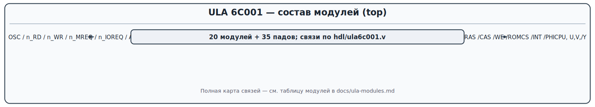.

Model-measured timings referenced by the sections:

- scanline: `HCrst`→`HCrst` = **448** `nCLK7` ticks (44.8 µs in the model);
- frame: **312** scanlines = 13.98 ms in the model; `V` resets on the 312th scanline;
- `VSync`: decade `V ∈ {248..251}` (`nor6` over `nV6,nV7,V2,nV3..nV5`);
- data fetches: **32 pixel bytes + 32 attributes** per scanline (in pairs,
  the attribute right after the pixel byte), `nAOLatch` reloads every 8
  `nCLK7` ticks (56 per scanline — including the border);
- `nINT`: a pulse at the beginning of the frame.

---

## 1. `clkgen` — clock generator (`÷2`, 7 MHz)

### Purpose

The only truly asynchronous node: it divides the input `OSC` (14 MHz on the
board, see [pads.md](/pads.md)) by two and produces the main video-path clock
`nCLK7` (~7 MHz). The chip has no external reset: the divider "arms" itself
right after power-on.

### Interface

```
clkgen (
  input  osc_from_pad,   // OSC с пада
  output nCLK7           // CLK7 = OSC/2
);
```

### Structure (reconstruction from gates g52, g54, g423..g432)

The divider proper is two cascaded RS latches (`// FD` in the source), i.e.
a "master–slave" D flip-flop wired as a counting ring (`nQ → D`):

| gates | function |
|---|---|
| `g52` | buffer-inverter `w441 = /OSC` |
| `g423,g424,g425` | master RS latch (`w442`, `w443`) |
| `g430,g431,g432` | slave RS latch (`w444..w446`, `w449`) |
| `g54` | buffer-inverter `nCLK7 = /w446` |

Here the RS latches are **not** shown as a NOR pair — this is a classic
divide-by-2 D flip-flop; that is exactly how it works (divides by 2):

```
   OSC ──┬─► буфер ──► [D-триггер ÷2] ──► буфер ──► nCLK7
         └──────────────── nQ ────────────────────┘  (обратная связь)
```

Diagram: 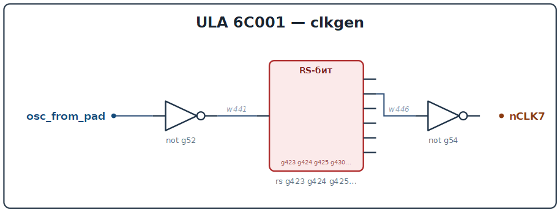.
Oscillogram (OSC, nCLK7, /PHICPU): 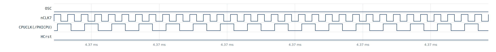.

### Behaviour (verified in the model)

`nCLK7` toggles once per **period** of `OSC` (÷2): in the
model with `OSC=20 MHz` the `nCLK7` period is 100 ns. `nCLK7` clocks the
h-counter, the data latches and the pixel shift register. `/PHICPU` (CPU
clock) is not generated here but in `contention` from the low bits of `C` —
essentially a `C0`-like signal (3.5 MHz) that gets stretched during
contention (see section 19).

### C++ (emulator)

```cpp
// clkgen: OSC/2 -> nCLK7
struct ClkGen {
    bool master = 0, slave = 0;          // два плеча D-триггера
    bool nCLK7   = 0;

    // вызывается по каждому изменению OSC (на платe 14 MHz)
    void eval(bool osc) {
        bool d = osc;                    // входной буфер/инвертор не меняет фазу
        if (!osc) { master = d; }        // master прозрачен при OSC=0
        else      { slave = master; }    // slave копирует при OSC=1
        nCLK7 = !slave;                  // выходной буфер-инвертор
    }
};
```

---

## 2. `tclk` — bus-cycle decoding

### Purpose

From the `/MREQ`, `/IOREQ`, `/RD`, `/WR` signals from the processor it forms
two internal strobes `nTCLKA`/`nTCLKB` (active when *both* requests
`/MREQ`+`/IOREQ` are low — i.e. in fact "bus busy"), plus the output `K0`
(test mode/keyboard scanline 0).

### Interface

```
tclk ( nMREQ, nIOREQ, nRD, nWR, WR(inout), RD(inout),
       output nTCLKA, nTCLKB(inout), K0, input nV8 );
```

`WR = /nWR`, `RD = /nRD` — just inverter-buffers (`g81`, `g82`).

### Gates and equations

```
g527:  nTCLKA = nor4(nMREQ, nIOREQ, WR, nRD)   = 1, только если все 4 входа = 0
g525:  nTCLKB = nor4(RD, nWR, nMREQ, nIOREQ)   = 1, только если все 4 входа = 0
g83:   w313   = not nTCLKB
g528:  K0     = nor(nV8, w313)                 // тестовый выход на KB0
```

`K0` (goes to pad `KB0`) is active when `nV8=0` and `nTCLKB=1` — i.e.
`K0 = nV8 · nTCLKB`. On the real board `KB0` is the only bidirectional
keyboard pin that the ULA can pull to zero.

Diagram: 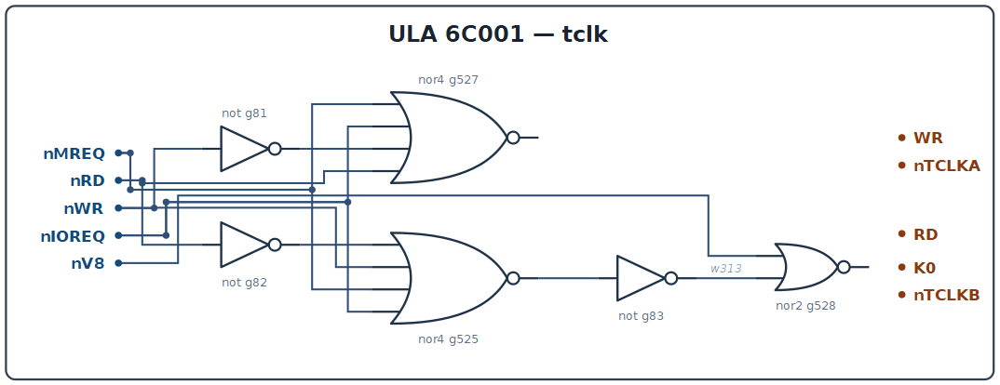.

### C++

```cpp
struct TClk {
    bool nMREQ, nIOREQ, nRD, nWR, nV8;
    bool nTCLKA, nTCLKB, K0;
    void eval() {
        bool WR = !nWR, RD = !nRD;
        nTCLKA = !( nMREQ || nIOREQ || WR || nRD );   // nor4
        nTCLKB = !( RD   || nWR   || nMREQ|| nIOREQ); // nor4
        K0     = !( nV8 || nTCLKB );                  // nV8 & nTCLKB
    }
};
```

---

## 3. `hcounter` — horizontal counter (448 clock ticks per scanline)

### Purpose

Counts the position within a scanline. Clocked from `nCLK7` (through internal
phases), it outputs `C[8:0]`/`nC[8:0]` to all consumers (video-memory
address, sync/blank logic, RAS/CAS decoders, arbitration). It is reset once
per scanline by the `HCrst` signal — **the count period is exactly 448 clock
ticks** (measured in the model: `HCrst`→`HCrst` = 448 periods of `nCLK7`).

### Interface

```
hcounter ( input nCLK7, nTCLKA,
           output [8:0] nC, C, output HCrst, CLKHC6 );
```

### Gate analysis

The counter is built from **identical bit cells**; each cell in the raw
netlist is 5-6 NORs (a "master–slave" RS latch with carry combinatorics),
shown here as an ordinary enabled T flip-flop:

- bit 0 (`g444..g455`): counts on the edges of `CLK7 = /nCLK7`;
- bits 1..5 (`g447..g522` etc.): the clock input is a combination of the
  phase and the low bits (carry cascade);
- bits 6..8 (`g98..g129`): additionally have the reset `HCrst`;
- `g518`: `CLKHC6 = nor(nTCLKA, nC[5])` — the clock of the vertical counter (see `vcounter`);
- `g104`: `HCrst = nor(nC[8], nC[7]) = C8 · C7` — the reset decade.

Key finding of the analysis: the reset happens not on the value 448 as such,
but on the decade `C8·C7` (count 384..447), combined with the clocking phase
of the high bits — the resulting scanline period is exactly **448**, which
corresponds to a 64 µs scanline at the real 7 MHz frequency.

Schematic: 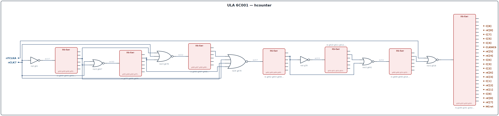.
Oscillograms: whole scanline 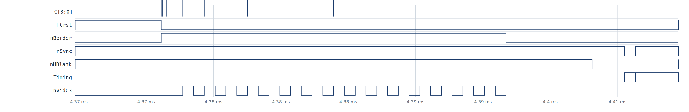,
low bits/phases *w_clockgen*.

### Measured behaviour

- `C0` toggles every 2 `nCLK7` clock ticks (3.5 MHz on the real chip);
- `HCrst` — one pulse per scanline (see [w_hline]).
- `CLKHC6` is used by the vertical counter: in idle (no bus activity,
  `nTCLKA=0`) `CLKHC6 = C5`.

### C++

```cpp
// hcounter: 9-битный счётчик строки, период 448, счёт по nCLK7
struct HCounter {
    uint16_t C = 0;              // C[8:0]
    bool HCrst = 0;

    void tick(bool nCLK7) {      // активный фронт nCLK7
        if (!nCLK7) {
            C = (C + 1) % 448;   // эквивалент сброса по декаде C8·C7
        }
        HCrst = (C >= 384);      // nor(nC8,nC7) — декада сброса
    }
    int  count() const { return C; }
};
```

Note: in the emulator the integer counter with modulus 448 gives the same
result as the gate-level decade, but without the 448-tick "tail"
(intermediate carry states are not needed in the emulator).

---


## 4. `vcounter` — vertical counter (312 lines per frame)

### Purpose

Counts the frame lines: `V[8:0]`/`nV[8:0]` go to the border/sync logic,
to the video memory address generator and to INT. Increment — once per line
(measured in the model: `V = V+1` on each `HCrst`), reset — on line 312
(frame = 312 lines, 20 ms at 7 MHz).

### Interface

```
vcounter ( input HCrst, CLKHC6, nC5,
           output [8:0] nV, V );
```

### Gate analysis

The counter bits are broken down in [vcounter.md](/vcounter.md) into standard cells:
- bits 0..2 — `TCE` (toggle with clock enable), clocked by `CLKHC6`;
- bits 3..5 — `TRCE` (TCE + reset); the additional internal reset `vrst`
  is produced in `g567` (reuses the inverter `g89` of bit 3);
- bits 6,7 — again `TCE`;
- bit 8 — `TRE` (TRCE without carry out; the redundant NOR is dropped, since the carry
  is not needed further on).

In `hdl/ula6c001.v` bits 3..8 are still marked `// not sure` — this is the zone
of the least confidence in the reverse-engineering (see `vcounter.md`, task #2 report),
so in the waveforms on the upper bits of `V` possible "within-line"
transitions — the model honestly shows the current state of the HDL.

Schematic: 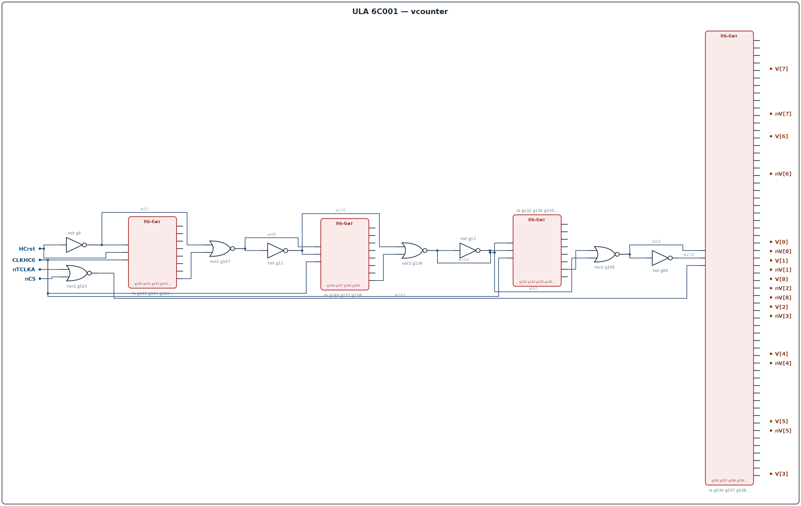.
Waveforms: vertical frame sweep 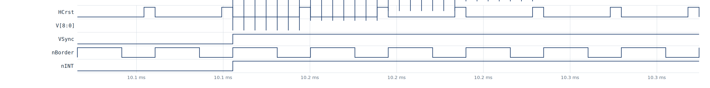,
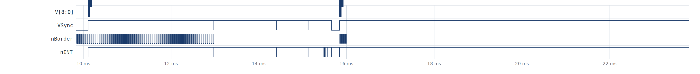.

### C++

```cpp
// vcounter: frame line counter; modulus 312
struct VCounter {
    uint16_t V = 0;              // V[8:0]
    void line() {                // once per line (on HCrst)
        V++;
        if (V >= 312) V = 0;     // 312 lines/frame
    }
};
```

---

## 5. `latch_control` — latch strobes and video mode

### Purpose

The most "controlling" module: it produces the active strobes of the data latch
(`nDataLatch`), attribute latch (`nAttrLatch`), object latch (`nAOLatch`),
the parallel load signal of the shift register (`SLoad`), the
"video-active area" flag (`VidEn`, `nVidEn`), as well as the auxiliary
`nVidC3`, `VidCASPulse`, `C0_other`, `Border`.

### Interface

```
latch_control ( input nCLK7, nBorder, nC0..nC3, C1,
                inout Border,
                output nAttrLatch, nDataLatch, nAOLatch,
                       nVidC3, C0_other, SLoad, nSLoad, VidEn,
                       VidCASPulse );
```

### Gates and equations

```
g49:  Border = /nBorder                      // "border" as a positive signal
g422: w349   = nor(nC3, Border);  g50: nVidC3 = /w349
        // nVidC3 = 0 (video) in the window: C3=0 and not border  -> "video-phase C3"
g55..g59: chain of buffer-inverters from nCLK7 (2-gate delay)
g449: VidCASPulse = nor(w394, nC0)            // pulse at the start of the line
g427: w396 = nor4(C1, nC0, VidCASPulse, nVidC3)
g408,g409: w398 = not not w396 (2 inverters); g51: nDataLatch = /w398
g443: SLoad = nor4(C1, nC2, nVidEn, C0_other); g339: nSLoad = /SLoad
g406: w339 = nor3(C1, nC0, nC2); g46: nAOLatch = /w339
g407: w419 = nor4(nC0, nVidC3, nC1, VidCASPulse); g47: nAttrLatch = /w419
GD viden_gd: VidEn/nVidEn — latch by nC3: at nC3=0 VidEn = /nBorder
```

Meaning: while `C` passes through the screen area (decodes on `C1..C3`), the latches
open in turn: `nAOLatch` — every 8 clocks (at the character-cell boundary),
`nDataLatch`/`nAttrLatch` — at the moment the pixel byte and the attribute following
it are fetched (in the model: 32 pairs per line, attribute ~200 ns later than the byte).

Schematic: 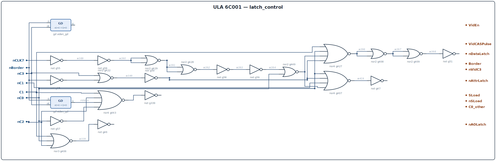.
Waveform: 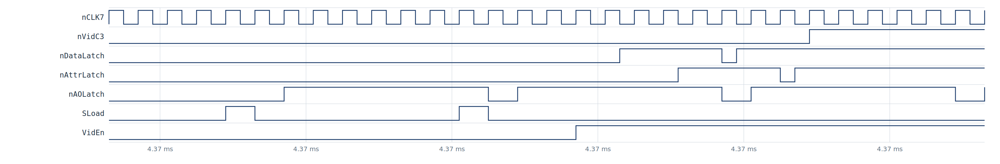.

### C++

```cpp
// strobes per formulas (per gates g422..g449, g406..g443)
struct LatchControl {
    bool nCLK7, nBorder;
    bool nC0, nC1, nC2, nC3, C1;
    bool nAttrLatch, nDataLatch, nAOLatch, nVidC3, VidCASPulse;
    bool C0_other, SLoad, nSLoad, VidEn;
    bool VidCASPulse_d1;                    // delay (g55..g59)

    void eval() {
        bool Border = !nBorder;
        bool w349 = !(nC3 | Border);        // g422
        nVidC3    = !w349;                  // g50
        VidCASPulse = !(VidCASPulse_d1 | nC0);  // g449 (g55..g59 delay)
        VidCASPulse_d1 = nCLK7;                  // (simplified: buffer chain)
        // nDataLatch = !(C1|nC0|VidCASPulse|nVidC3)  after 2 inverters (g408/9)
        bool w396 = !(C1 || nC0 || VidCASPulse || nVidC3);
        nDataLatch = !w396;                 // g51
        C0_other   = !nC0;                  // g57
        bool w339 = !(C1 || nC0 || nC2);    // g406
        nAOLatch   = !w339;                 // g46
        bool w419 = !(nC0 || nVidC3 || nC1 || VidCASPulse); // g407
        nAttrLatch = !w419;                 // g47
        SLoad = !(C1 || nC2 || nVidEn_out() || C0_other);   // g443
        nSLoad = !SLoad;                    // g339
    }
};
```


---

## 6. `data_latch` — pixel byte latch

### Purpose

A transparent 8-bit latch (`GD dl[7:0]`): during the `nDataLatch` strobe
it captures the data byte `D7..D0` from the data bus (ULA video memory read) and
stores it until the next character cell. The outputs are inverted `nDL[7:0]`
(it uses the latches' `nQ`), because the shift register downstream is built on NOR.

### Interface

```
data_latch ( input [7:0] DI,   // DI = {D7..D0}_from_pad (most significant bit first)
             input nDataLatch,
             output [7:0] nDL );    // nDL[i] = nQ of latch i
```

### Gates and C++

```cpp
struct DataLatch {
    uint8_t dl = 0;
    void eval(bool nDataLatch, uint8_t D) {
        if (!nDataLatch) dl = D;         // transparent latch
    }
    uint8_t nDL() const { return ~dl; }  // nQ outputs
};
```

Schematic: 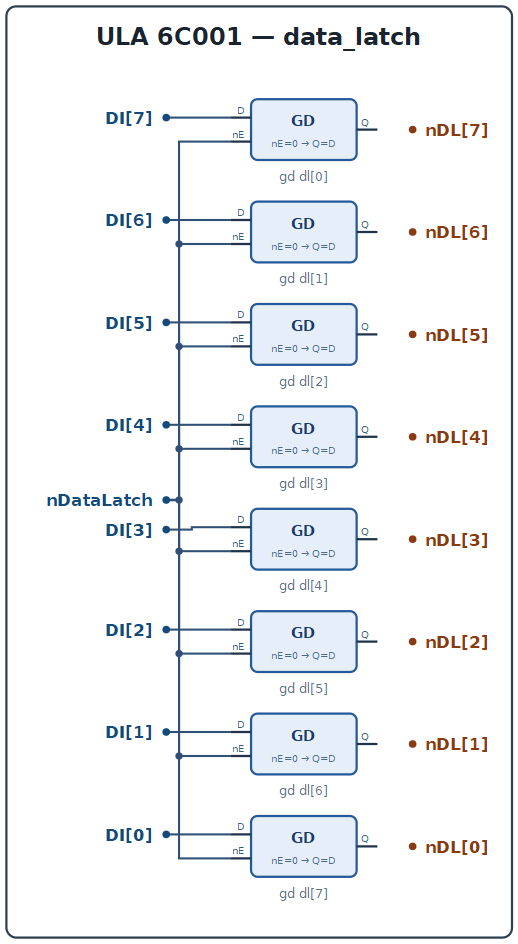 (8× `GD`).

---


## 7. `attr_latch` — attribute latch + ink/paper selection

### Purpose

Latches the attribute byte (ink/paper colour, brightness, flash) during
`nAttrLatch`, then, taking `VidEn` into account, drives the composite signals
into the object latch: the ready ink/paper colour for each component
(`PB0_B`,`PB1_R`,`PB2_G`) and the half-bright `AL[6]=HL`, `AL[7]=FL`.

The attribute bits (ZX Spectrum): `D7=FLASH`, `D6=BRIGHT`, `D5..D3=PAPER`,
`D2..D0=INK`. The logic with `VidEn` does the following: when the video-active
area is disabled (`VidEn=0`), the border colour (`B0_B..B2_G` from `io`) is
substituted into ink/paper, i.e. a "paper/border" multiplexer operates
(comment `// +paper/border mux` in the source).

### Interface

```
attr_latch ( input nAttrLatch, B0_B, B1_R, B2_G, VidEn,
             input D7..D0_from_pad,
             output [7:0] AL, PB0_B, PB1_R, PB2_G );
```

### Gates (after reduction)

```
GD al[7:0]: AL(capture) by nAttrLatch, al_7..al_0 = D7..D0
g34/g309: AL[6] = nor(~al_6, nVidEn) = al_6 · VidEn     // HL
g35/g326: AL[7] = al_7 · VidEn                          // FL
B:  PB0_B = nor( nor(AL[3], nVidEn), nor(B0_B, VidEn) ) // paper/border blue
R:  PB1_R = same with AL[4] and B1_R
G:  PB2_G = same with AL[5] and B2_G
```

`al_6` (attribute `D6`, BRIGHT) passes to `AL[6]` only in the video-active
area (`VidEn`); likewise for `al_7` (D7, FLASH). The paper bit of the B
channel (`AL[3]`) is replaced in `PB0_B` by the border colour `B0_B` when
`VidEn=0`, and so on — this is the "paper/border" multiplexer.

Schematic: 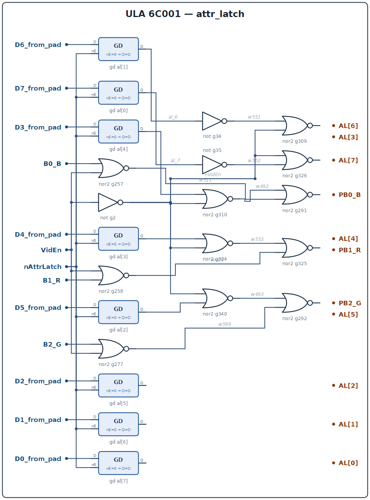.

### C++

```cpp
struct AttrLatch {
    uint8_t al = 0;                       // захваченный атрибут
    bool B0_B, B1_R, B2_G, VidEn;
    void latch(bool nAttrLatch, uint8_t d) { if (!nAttrLatch) al = d; }
    void eval() {
        bool nVidEn = !VidEn;
        AL6_HL = nVidEn || !bit(al,6);    // nor g309
        AL7_FL = nVidEn || !bit(al,7);
        PB0_B  = !( (nVidEn && !bit(al,3)) || (B0_B && VidEn) );
        PB1_R  = !( (nVidEn && !bit(al,4)) || (B1_R && VidEn) );
        PB2_G  = !( (nVidEn && !bit(al,5)) || (B2_G && VidEn) );
    }
};
```

---

## 8. `ao_latch` — object latch (ink/paper/border for the DAC)

### Purpose

Holds the 8-bit "object" that determines the pixel colour at each moment.
It is reloaded every 8 `nCLK7` cycles (at the character-cell boundary,
`nAOLatch`), including in the border area, when the inputs carry the border
colour (`PB*` from `io`/`attr_latch`). Output `AO` is read by `color_mux`,
`dac_setup` (HL) and `flash_xnor` (FL). The bits of `AO` are shuffled so that
the (paper, ink) pairs go by colour channels (see below in this section).

### Interface

```
ao_latch ( input nAOLatch, input [7:0] AL, PB0_B, PB1_R, PB2_G,
           output [7:0] AO );
```

### Structure

```
GD ao[7:0]: D = { AL[7], AL[6], PB2_G, AL[2], PB1_R, AL[1], PB0_B, AL[0] }
              Q = AO            // AO[i] = D[i] (i = 0..7)
```

I.e. the shuffling: `AO[7]=FL`, `AO[6]=HL`, `AO[5]=PB2_G` (paper green),
`AO[4]=AL[2]` (ink green), `AO[3]=PB1_R` (paper red), `AO[2]=AL[1]` (ink red),
`AO[1]=PB0_B` (paper blue), `AO[0]=AL[0]` (ink blue). The border colour for
the "video off" case is already folded into `PB*` from `attr_latch`, so AO
always contains the correct colour of the current object.

Schematic: 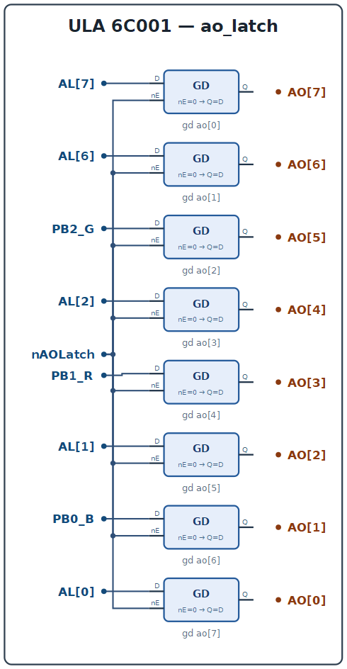.

### C++

```cpp
struct AOLatch {
    uint8_t ao = 0;
    // AO = { AL7, AL6, PB2_G, AL2, PB1_R, AL1, PB0_B, AL0 }
    void eval(bool nAOLatch, uint8_t AL,
              bool PB0_B, bool PB1_R, bool PB2_G) {
        if (!nAOLatch) {
            ao = ((AL >> 7) & 1) << 7 | ((AL >> 6) & 1) << 6 |
                 (PB2_G & 1) << 5 | ((AL >> 2) & 1) << 4 |
                 (PB1_R & 1) << 3 | ((AL >> 1) & 1) << 2 |
                 (PB0_B & 1) << 1 | (AL & 1);
        }
    }
};
```


---

## 9. `pixel_shift_reg` — pixel shift register

### Purpose

Converts the pixel byte `nDL[7:0]` (from `data_latch`) into a serial
`SerialData` stream at one bit per `nCLK7` cycle. Parallel load happens on
`SLoad` (at the start of every character cell), shifting — on the edges of
`nCLK7`.

### Interface

```
pixel_shift_reg ( input nCLK7, SLoad, nSLoad,
                  input [7:0] nDL,
                  inout SerialData );
```

### Analysis

Each of the 8 stages is a master–slave cell (in raw form 6-8 NORs per bit,
here — a D flip-flop with a load circuit):

```
гр. g482..g486  : бит 0
гр. g461..g465  : бит 1
гр. g456..g460  : бит 2
...
гр. g398..g401  : бит 7, выход SerialData = сдвиг старшего разряда
```

Output order: bits shift from 7 down to 0; the MSB (first pixel of the
character cell) leaves on `SerialData` first. `SLoad` enables the parallel
input `nDL[i]` for ~8 cycles, then `nCLK7` cycles shift the byte. In
`color_mux` the stream is compared with the attribute (see `flash_xnor`).

Schematic: 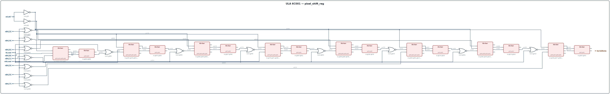.
Oscillogram (SLoad/SerialData/ink-paper selection): 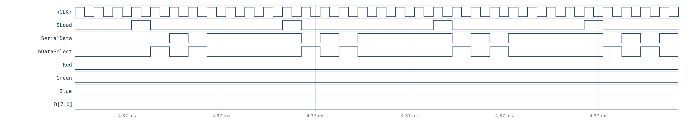.

### C++

```cpp
struct PixelShiftReg {
    uint8_t reg = 0;
    bool SerialData = 0;
    // загрузка по SLoad (активный уровень 1), сдвиг по nCLK7
    void tick(bool nCLK7, bool SLoad, uint8_t nDL) {
        if (SLoad) { reg = ~nDL; SerialData = (reg >> 7) & 1; return; }
        if (!nCLK7) {                 // на каждом такте выдаём старший бит
            SerialData = (reg >> 7) & 1;
            reg = (reg << 1);         // MSB первым, младшие добиваются нулём
        }
    }
};
```


---


## 10. `flash_clock` — flash-rate divider

### Purpose

Divides the reference clock (in the model — packets at `nV8`/`nTCLKB` edges) down
to ~1.5–3 Hz — the flash rate of the `FLASH` attribute. The `FlashClock` output
controls ink/paper inversion in `flash_xnor`.

### Interface

```
flash_clock ( input nTCLKB, nV8, inout FlashClock );
```

### Analysis

Five cascaded counter cells (grp. g180..g209), each ÷2, i.e. ÷32 total from the
input packet:

```
g529: w33 = nor(nTCLKB, nV8)            // входные импульсы (шина или кадр)
бит0: g180/g181/g207..g210
бит1: g182/g183/g203..g206
бит2: g184/g185/g199..g202
бит3: g186/g187/g195..g198
бит4: g188..g194 → FlashClock
```

On a real Spectrum board flash is counted from CPU activity (each `MREQ`),
i.e. the rate is tied to the number of executed instructions; in the model with a
"chip in a vacuum" the count comes from `nV8` (V-counter) edges.
Diagram: 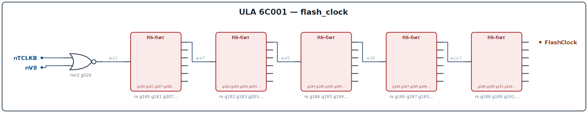.

### C++

```cpp
struct FlashClock {
    uint16_t cnt = 0;
    bool FlashClock = 0;
    void pulse() {                       // фронт входного пакета
        cnt = (cnt + 1) & 0x1F;          // 5 бит (÷32)
        FlashClock = (cnt >> 4) & 1;     // старший разряд
    }
};
```

---

## 11. `flash_xnor` — per-pixel ink/paper selection and flash

### Purpose

Compares the current bit of the `SerialData` pixel stream with the `FlashClock`
flash bit (attribute `FL`) and produces `nDataSelect` — the "ink or paper"
selector for the colour mux:

- pixel = 0 → paper, pixel = 1 → ink;
- if `FL=1` and `FlashClock=1` — inversion (flash).

### Interface

```
flash_xnor ( input FL, FlashClock, SerialData, output nDataSelect );
```

### Gates

```
g79 : w195 = not FL
g516: w64 = nor(w199, w196);  g517: w196 = nor(w195, FlashClock)
g487: w65 = nor(SerialData, w199); g488: w199 = nor(w196, SerialData)
g190: nDataSelect = nor(w64, w65)
```

After reduction (the cross-coupled pairs are an XNOR equivalent):

```
nDataSelect = ~( (FL ^ FlashClock) == SerialData )
```

Schematic: 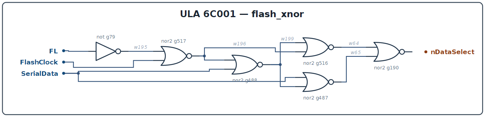.

### C++

```cpp
struct FlashXnor {
    bool nDataSelect;
    void eval(bool FL, bool FlashClock, bool SerialData) {
        bool dataSel = (FL ^ FlashClock) == SerialData;  // 1 -> ink
        nDataSelect = !dataSel;
    }
};
```

---

## 12. `color_mux` — R/G/B assembly

### Purpose

Assembles the three video signals `Red`, `Green`, `Blue` from `AO` (object
colour) and `nDataSelect` (ink/paper), taking blanking into account: in
`HBlank`/`VSync` the colour = 0.

### Interface

```
color_mux ( input nHBlank, VSync, nDataSelect, input [7:0] AO,
            output Red, Green, Blue );
```

### Equations (after reduction, `assign` in HDL)

```
HBlank = ~nHBlank;  DataSelect = ~nDataSelect;

Green = ~( ~(AO[5]|DataSelect) | ~(AO[4]|nDataSelect) | HBlank | VSync );
Red   = ~( ~(AO[3]|DataSelect) | ~(AO[2]|nDataSelect) | HBlank | VSync );
Blue  = ~( ~(AO[1]|DataSelect) | ~(AO[0]|nDataSelect) | HBlank | VSync );
```

Channel pairs: Blue — `(AO[1],AO[0])`, Red — `(AO[3],AO[2])`,
Green — `(AO[5],AO[4])`; the left bit of a pair is paper, the right one is ink
(the bit permutation was already done in `ao_latch`). Active `DataSelect=1`
selects the ink component of a pair, otherwise — paper.

Schematic: 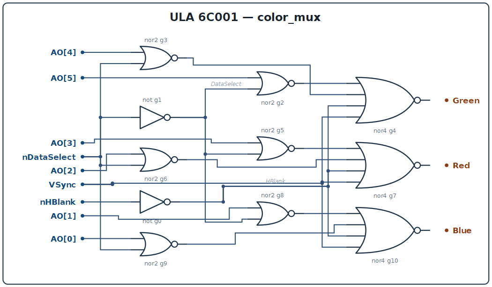.
Oscillogram: *w_pixels* (Red/Green/Blue rows).

### C++

```cpp
struct ColorMux {
    bool Red, Green, Blue;
    void eval(bool nHBlank, bool VSync, bool nDataSelect, uint8_t AO) {
        bool blank = !nHBlank || VSync;
        bool ds = !nDataSelect;
        if (blank) { Red = Green = Blue = 0; return; }
        auto ch = [&](bool paper, bool ink) {   // paper/ink = AO биты
            return ds ? ink : paper;
        };
        Blue  = ch((AO >> 1) & 1, AO & 1);
        Red   = ch((AO >> 3) & 1, (AO >> 2) & 1);
        Green = ch((AO >> 5) & 1, (AO >> 4) & 1);
    }
};
```

---

## 13. `video_addr_gen` — video-memory address (row/col)

### Purpose

Forms the 7-bit row and column addresses for the DRAM from the `C` and `V`
counters (7 lines `A0..A6` each on the RAS/CAS phases). Implements the
"scrambled" ZX Spectrum screen addressing (character cell → three screen thirds
and 8 rows of a character cell). Also outputs `nVidRAS` (the inverse of
`VidRAS`).

### Interface

```
video_addr_gen ( input C1,C2,C4..C7, V0..V7, VidRAS,
                 output nVidRAS, A0_to_pad..A6_to_pad );
```

### Analysis

The combinational logic (grp. g7..g96, g530..g618) is folded into a "row/col"
mux: the internal buses `w99/w100/w101/w102`, `w115` and `w217` are the RAS
phases (`w102 = VidRAS-delayed` and its inverses), while `g530..g582` is a
buffer chain (an even number of inverters) that equalises the delay of `w217`.
Output functions:

```
A0 = f(C1, V5, w217-фаза);   A1 = f(C4, V6, V0);
A2 = f(C5, V7, V1);          A3 = f(C6, V2, w99-фаза);
A4 = f(C7, V6);              A5 = f(V7, V3);
A6 = f(V4, w99-фазы);
```

Exact formulas are in the gate table below:

| Output | Gates | Structure |
|---|---|---|
| `A0` | g593, g616..g617, g615 | `nor3( nor(V5,w115), nor(w99,V5), nor(w217,w216) )` + buffer |
| `A2` | g583..g586 | `nor3( nor(C5,w217), nor(w115,V1), nor(V7,w99) )` |
| `A5` | g560..g561 | `nor2( nor(V7,w115), nor(w217,V3) )` |
| `A1` | g590..g592 | `nor3( nor(V6,w99), nor(w115,V0), nor(w217,C4) )` |
| `A3` | g588..g589, g618 | `nor3( nor(C6,w217), nor(V2,w115), not(w99) )` |
| `A4` | g557, g559, g587 | `nor2( nor(C7,w217), nor(w115,V6) )` |
| `A6` | g562, g555 | `nor3( nor(V4,w217), not(w115), not(w99) )` |

where `w99 = ~w100`, `w100 = nor(w101,w102)`, `w101 = ~C1`, `w102 = VidRAS-ф.`,
`w115 = ~w114`, `w114 = nor(w102, C1)`, `w217 = ~w102`.

Schematic: 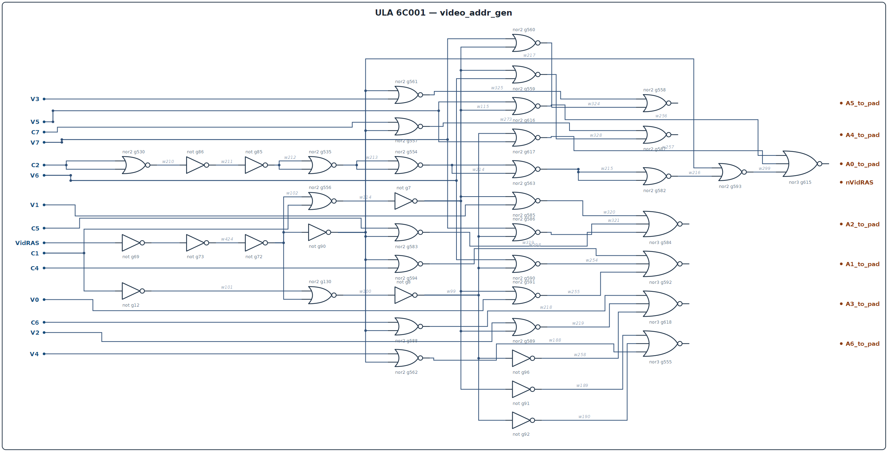.
Oscillogram (address on RAS/CAS phases): 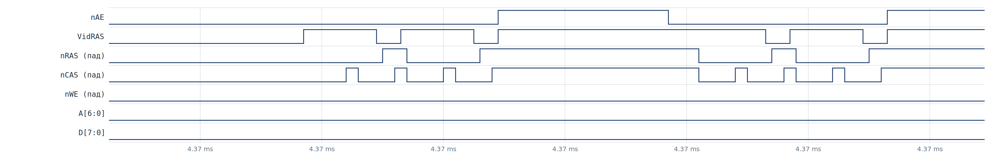.

### C++

```cpp
// видеоадрес: 14-битный адрес экрана из (C,V), выдаётся двумя фазами
struct VideoAddrGen {
    // 7 бит row (фаза RAS) и 7 бит col (фаза CAS)
    uint8_t row, col;
    void gen(uint16_t C, uint16_t V) {
        // стандартная раскладка экрана ZX Spectrum 48K
        uint16_t vc = ((V & 0x7) << 8) | ((V >> 3) & 7) << 5 |
                      ((V >> 6) & 0x1F);
        uint16_t hc = (C & 0x1F);
        uint16_t addr = (vc << 5) | hc;
        row = addr & 0x7F;         // младшие 7 бит (RAS)
        col = (addr >> 7) & 0x7F;  // старшие 7 бит (CAS)
    }
};
```

---

## 14. `address_enable` — address pad enable (`nAE`)

### Purpose

Controls the third state of the address outputs `A0..A6` (pads with `n_oe`).
When `nAE=0` the ULA drives the address; when `nAE=1` the pads are in Z, and the
DRAM can address the processor (external board glue).

### Interface

```
address_enable ( input nC0, nC1, nC2, C3, Border, output nAE );
```

### Equations

```
g426: w399 = nor3(nC0, nC1, nC2)         // = C0&C1&C2
g410: w363 = nor(C3, w399)
g391: w420 = nor(Border, w363)
g661: nAE   = not w420

nAE = Border  |  C3  |  (C0&C1&C2)   // active (0) only outside the border,
                                     // in video-memory fetch windows
```

Schematic: 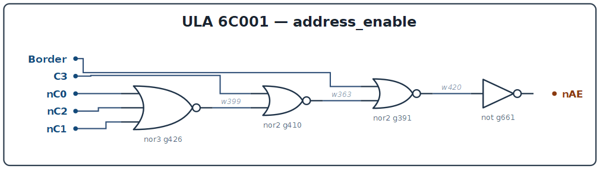.

### C++

```cpp
struct AddressEnable {
    bool nAE;
    void eval(bool nC0, bool nC1, bool nC2, bool C3, bool Border) {
        bool w399 = C0_bit(nC0) && C0_bit(nC1) && C0_bit(nC2); // C0&C1&C2
        nAE = Border || C3 || w399;     // 0 = drive address
    }
    static bool C0_bit(bool nx){ return !nx; }
};
```

---

## 15. `ras_cas_romcs` — DRAM timing and ROM select

### Purpose

Generates the dynamic-memory control signals: `VidRAS`/`nVidRAS`
(video RAS), the RAS strobe for processor cycles in the RAM area (`w242`/
`RAM16`), the output `/RAS` (with `nRAS_oe`), `/CAS`, `/WE`, plus `/ROMCS`
(ROM select) and the CAS-phase latches `VidCASPulse`.

### Interface

```
ras_cas_romcs ( input nVidC3, A14, A15, nMREQ, nWR, WR, RD,
                input nC0, nC1, C1, nVidRAS, nBorder, VidCASPulse,
                output nRAS_to_pad, nRAS_oe, nCAS_to_pad, VidRAS,
                       nROMCS_to_pad, nWE_to_pad );
```

### Analysis

```
g389: w242 = nor3(not A14, A15, nMREQ)   // = A14 & /A15 & /MREQ : RAM16
                                          //  (processor accesses 0x4000-0x7FFF)
g390: nRAS_to_pad = nor(VidRAS, w242)     // RAS = video OR processor-RAM
g388: nRAS_oe     = nor4(A15, A14, nBorder, nMREQ)
g451: VidRAS      = nor(w395, nVidC3)     // video RAS in the active area
g395: w395        = nor3(nC0, nC1, w400)  // counter phase (delays g60..g71)
g387: w408 = nor(A15, A14);  g39: nROMCS_to_pad = not w408
                                              // /ROMCS = A15|A14 (RAM -> no ROM)
g503: w239 = nor(WR, RD); ...  g501..g506: MUXSEL latch buffers
g526: w315 = nor(w245, nWR); g87: nWE_to_pad = not w315   // /WE = w245·/WR
g473..g477: CAS decades: nCAS_to_pad = ... (w433/w434 with VidCASPulse, C1, nVidC3)
```

`VidRAS` starts both phases: RAS (row address), then, through
`VidCASPulse` and the delay buffers, CAS (column address). The chains of even
inverters (g60..g71, g65..g70, etc.) are **delay lines** that set the strobe
widths (in the model the RAS width is ≈ 275 ns; CAS is a burst of pulses).

Schematic: 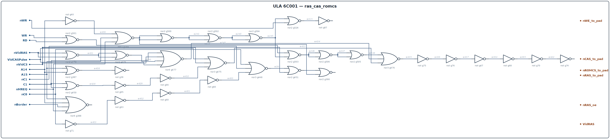.
Oscillogram: *w_memory*.

### C++

```cpp
struct RasCasRomcs {
    bool VidRAS, nRAS, nCAS, nWE, nROMCS, RAM16;
    // called every nCLK7 cycle
    void eval(bool nVidC3, bool A14, bool A15, bool nMREQ,
              bool nWR, bool nBorder, bool VidCASPulse,
              uint16_t C) {
        RAM16 = A14 && !A15 && !nMREQ;
        bool phase = fetch_phase(C);         // fetch window per the counter
        VidRAS = phase && !nVidC3 && !nBorder;
        nRAS   = !(VidRAS || RAM16);
        bool ramsel = !(A15 || A14);          // 0x0000-0x3FFF (ROM)
        nROMCS = !ramsel;
        nWE    = !(RAM16 && !nWR);
        // CAS: delayed VidCASPulse + counter phases (simplified):
        nCAS   = !(VidRAS && delay(VidCASPulse, 3));
    }
};
```

---

## 16. `video_signal_features` — sync, blank, border, INT, burst

### Purpose

A purely combinational "calendar" of the video signal: from `C` and `V` it
forms `/Sync` (HSync+VSync), `nHBlank`, `nBorder` (active area), `/INT`, the
`Timing` window, the colour-burst packets `BurstS/nBurstS/nBurstDD`,
`C5delay`, and `HSync` pulses.

### Interface

```
video_signal_features ( input nC3..nC8, C4..C8, V0..V2, V8, nV3..nV7,
                        inout Timing,
                        output nSync, VSync, nHBlank, nINT_to_pad,
                               nBurstS, BurstS, nBorder, nBurstDD );
```

### Key equations (after gate analysis)

```
g613: w271 = nor(nV7, nV6)
g614: nBorder = nor3(C8, V8, w271)     // 0 = border/non-screen (C8 or bottom of frame)

g167..g172: C5delay (w103) — delayed C5 through the buffer chain
g531..g534: HSync window w71 ("nHSyncPulses");  g84: w71 = ... (see the source)
g105: w118 = nor4(nC6, C7, nC8, w71)  // HSync
g106: nSync = nor(VSync, w118)         // /Sync = HSync | VSync
g107,g131,g133: nHBlank = nor(w69, w68)  // H blanking at line start/end
g119,g120,g150,g151: Timing latch (nSync-window latch with V0)
g621: VSync = nor6(nV6, nV7, V2, nV3, nV4, nV5)   // V ∈ {248..251}
g620: w143 = nor5(nC8, nC7, C4, C6, w103)
g619: w116 = nor7(C6, C7, not VSync, V1, V2, V0, C8)
g4:   nINT_to_pad = not w116           // INT at the start of the frame
g118,g6: nBurstS/nBurstDD; g117: BurstS  // colour burst
```

`Timing` is an internal latch (`g119,g120,g150,g151`) that "stretches" the
sync window; it is exactly what `dac_setup` and the burst logic use.

Schematic: 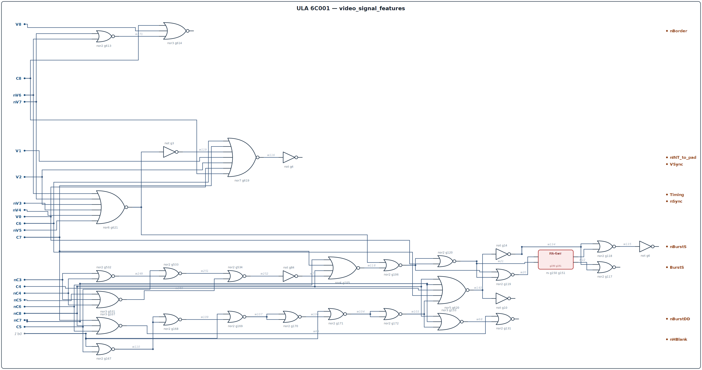.
Oscillograms: *w_hline*,
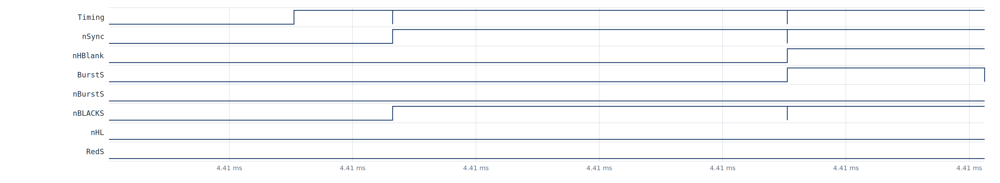,
*w_vframe*, *w_frame*.

### C++

```cpp
struct VideoSignalFeatures {
    bool nSync, VSync, nHBlank, nBorder, nINT;
    void eval(uint16_t C, uint16_t V) {
        // windows measured in the model (448-cycle line, 312 lines)
        bool C8 = (C >> 8) & 1, C7 = (C >> 7) & 1, C6 = (C >> 6) & 1;
        bool V7 = (V >> 7) & 1, V6 = (V >> 6) & 1, V5 = (V >> 5) & 1;
        bool V4 = (V >> 4) & 1, V3 = (V >> 3) & 1, V2 = (V >> 2) & 1;
        nBorder = !(C8 || (V >= 248));            // simplified, see equations
        VSync   = (V & 0x1FF) >= 248 && (V & 0x1FF) <= 251;
        bool hsync = C >= 368 && C < 400;         // HSync window (approximately)
        nSync   = !(VSync || hsync);
        bool hblank = C >= 384 || C < 16;         // left/right blank
        nHBlank = !hblank;
        nINT    = !(V < 8 && C < 64);             // start of frame
    }
};
```

Note: the windows in the C++ above are *illustrative*; the exact gate-level
decades are given in the table and in the source `hdl/ula6c001.v`.

---


## 17. `dac_setup` — video DAC input preparation

### Purpose

From the color signals (`Red/Green/Blue`), sync, and `Timing`, forms the
15 digital inputs `i0..i14` of the video DAC (pads U/V//Y): normal color,
half brightness (`D`/`DD`), blanking (`BLACKS`), sync (`nSyncD`), `HL`
(high-light), burst packets.

### Interface

```
dac_setup ( input Timing, nSync, Red, HL(AO[6]), Blue, Green,
            output BlueD, RedD, nRedDD, nBLACKS, nHL, nSyncD, GreenD,
                   RedS, BlueDD, nGreenDD, nBlueS, nGreenS );
```

### Equations (from gates g1..g23, g152..g179, g211..g216, g624,g625)

```
g152: w152 = nor3(Green, Red, Blue)          // нет ни одного цвета -> 0
g174: w129 = nor3(w130, w3, w128)            // "black": гашение по цветам
g19 : nBLACKS = not w129                     // сигнал /BLACKS на ЦАП
g23 : nHL = not AO[6]                        // high-light (HL)
g5  : nSyncD = not not nSync                 // буфер nSync
// каналы:
R: RedD  = not not Red;   nRedDD = nor(w152, Red)
G: GreenD= not not Green; nGreenDD= nor(Green, w152)
B: BlueD = not not Blue;  BlueDD = not nor(w152, Blue)  // g20/g21/g214
// яркостные "S" (после Timing-логики g176..g178):
RedS  = not nor(w129, w128)  ...  nGreenS = nor(w3, w129); nBlueS = nor(w130, w129)
```

Double inverters (`g15..g18` and the like) provide delay/buffering of the
DAC halves (brightness and half brightness). See the source for the exact
gate table.

Schematic: 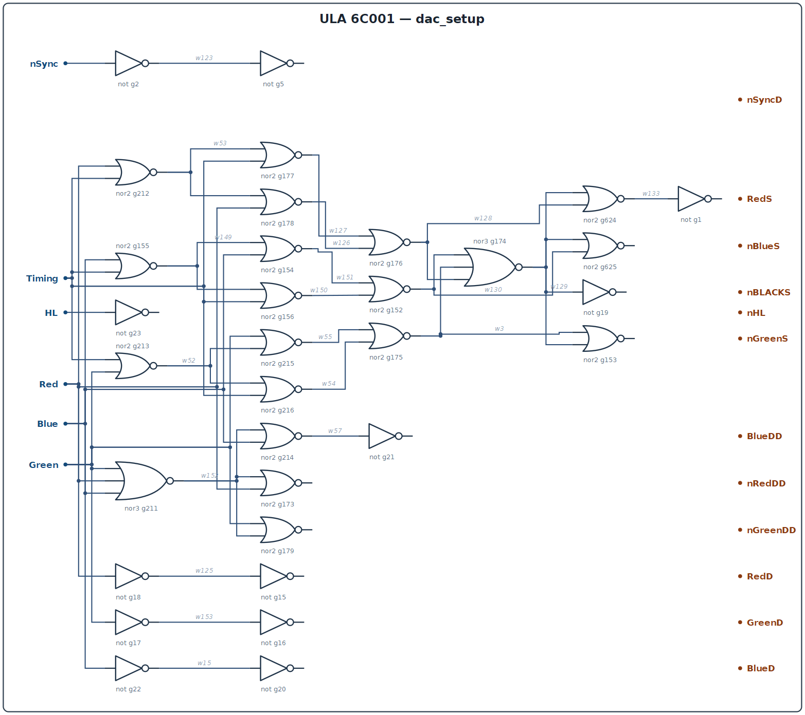.
Waveform: *w_dac_sync*.

### C++

```cpp
struct DacSetup {
    // входы ЦАП (см. pads.md: U,V,/Y аналоговые; здесь цифровые биты)
    bool BlueD, RedD, nRedDD, nBLACKS, nHL, nSyncD, GreenD;
    bool RedS, BlueDD, nGreenDD, nBlueS, nGreenS;
    void eval(bool Timing, bool nSync, bool Red, bool HL,
              bool Blue, bool Green) {
        bool none = !(Green || Red || Blue);          // nor3
        nBLACKS  = !none;
        nHL      = !HL;
        nSyncD   = nSync;
        RedD  = Red;   GreenD = Green;   BlueD = Blue;
        nRedDD = !none && !Red;                       // гашение красного
        nGreenDD = !none && !Green;
        BlueDD   = none || Blue;
        RedS  = !none && Red;                         // после Timing-логики
        nGreenS = !none || Green;
        nBlueS  = !none || Blue;
    }
};
```

---

## 18. `io` — I/O port (keyboard, border, mic/ear)

### Purpose

Decodes CPU accesses to the ULA ports (`/IOREQ` + `A0=0`):
- **write** (`nPortWR`): 5-bit register — `Speaker`, `Tape`, `B2_G`, `B1_R`,
  `B0_B` (beep, mic, border color);
- **read** (`nPortRD`): keyboard lines `KB0..KB4` onto `D4..D0` and the
  EAR input onto `D6`.

### Interface

```
io ( input nIOREQ, nWR, nRD, nIOREQT2, A0_from_pad,
     input KB4..KB1_from_pad, KB0_from_pad, D0..D4_from_pad,
     input Ear_Input,
     output nTape, B0_B, B1_R, B2_G, D6_to_pad, D1_to_pad, ... , nSpeaker );
```

### Analysis

```
g622: w237 = nor4(nIOREQ, A0_from_pad, nWR, nIOREQT2); g77: nPortWR = not w237
g623: w317 = nor4(nIOREQ, A0_from_pad, nRD, nIOREQT2); g80: nPortRD = not w317
       // порт открыт, когда /IOREQ=0, A0=0 и нет "IOREQ в фазе 2" (contention)
KB:  D4_to_pad = not nor(nPortRD, KB4) ...  D0_to_pad = not nor(KB0, nPortRD)
Ear: D6_to_pad = not nor(Ear_Input, nPortRD)
GD port[4:0]: по nPortWR: Q = {Speaker, Tape, B2_G, B1_R, B0_B} = D4..D0
g37: nTape = not Tape ;  g38: nSpeaker = not Speaker
```

`B0_B/B1_R/B2_G` go to `attr_latch` as the border color (see section 7);
`nSpeaker`/`nTape` are open collectors on the SOUND pad (in `hdl/ulabase.v`
the pad model is stubbed out: `from_pad = 0`).

Schematic: 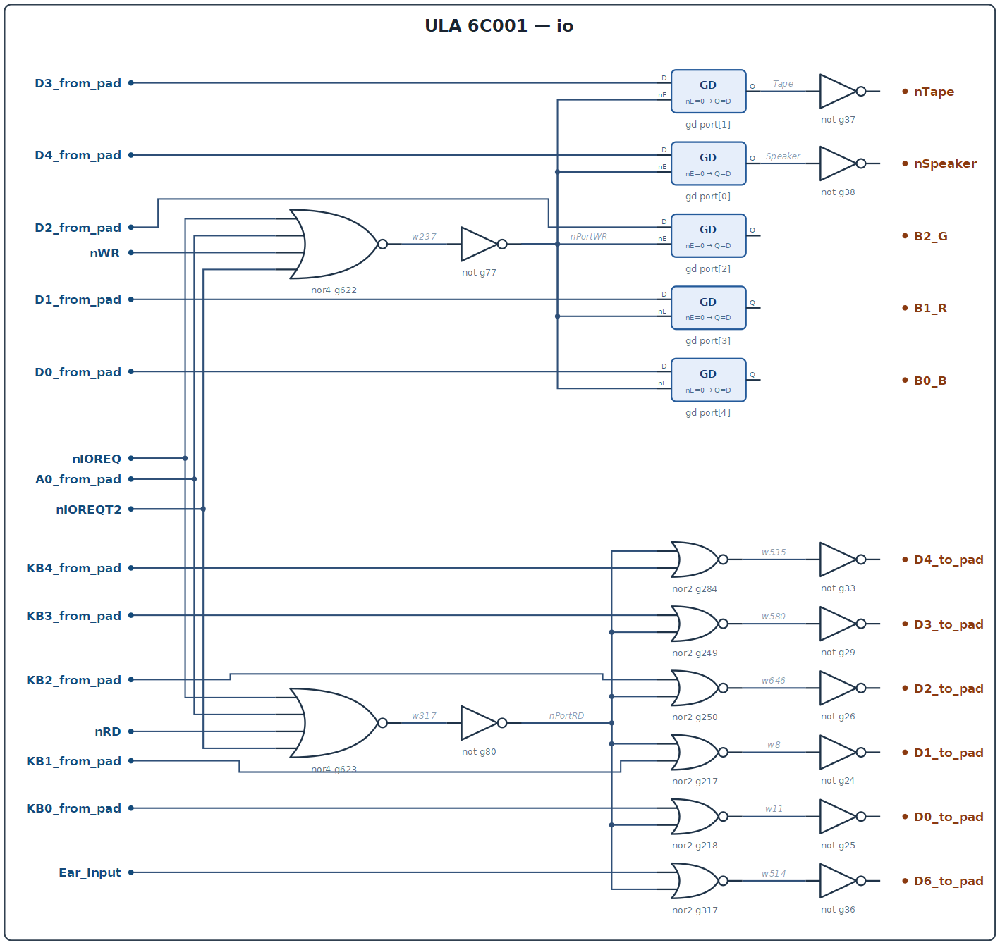.
Waveform: 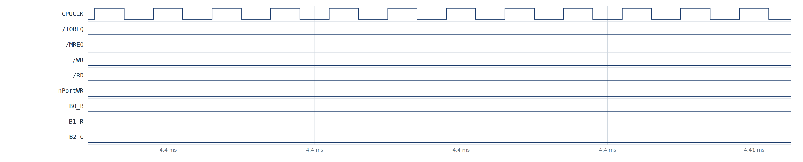.

### C++

```cpp
struct IO {
    bool nPortWR = 1, nPortRD = 1;
    bool B0_B=0, B1_R=0, B2_G=0, Speaker=0, Tape=0;
    uint8_t reg = 0;                      // 5-битный порт
    void decode(bool nIOREQ, bool A0, bool nWR, bool nRD, bool nIOREQT2) {
        bool sel = !nIOREQ && !A0 && !nIOREQT2;
        nPortWR = !(sel && !nWR);
        nPortRD = !(sel && !nRD);
    }
    void write_cycle() {
        if (!nPortWR) { reg = reg; /* взять D4..D0 с шины */ }
        B0_B = (reg >> 0) & 1; B1_R = (reg >> 1) & 1; B2_G = (reg >> 2) & 1;
        Tape = (reg >> 3) & 1; Speaker = (reg >> 4) & 1;
    }
    bool d4_from_kb(bool kb4) { return !(!nPortRD && kb4); }  // к паду D4
};
```

---

## 19. `contention` — DRAM arbitration (CPU clock stretching)

### Purpose

The trickiest place: it decides who currently owns the DRAM (video or CPU)
and forms the processor clock `CPUCLK` (`/PHICPU`). In idle, `CPUCLK` repeats
`C0` (3.5 MHz). When the CPU tries to reach the RAM (0x4000–0x7FFF) at the
moment the video is fetching memory, the `CPUCLK` edge is delayed — the famous
ZX Spectrum “contention” (a clock pause of 1..6 half-ticks, depending on the
phase).

### Interface

```
contention ( input nMREQ, nIOREQ, Border, A14, A15, C2, C3, C0_other,
             output CPUCLK, nIOREQT2 );
```

### Analysis

```
GD mreq_gd :  MREQT2 = ~D(nMREQ), прозрачна при CPUCLK_internal=0
GD ioreq_gd:  nIOREQT2/IOREQT2 = захват nIOREQ по CPUCLK_internal
g384: w414 = nor(w359, w477, C0_other)     // C0_other = C0 (3.5 МГц)
g44 : CPUCLK = not w414                    // CPUCLK_internal = not w414
g411: w360 = nor(C2, C3)
g383: w477 = nor(w413, w412, w360, w361)   // решение "RAM-доступ CPU"
g385: w412 = nor(w410, w411);  w411 = not A15;  w410 = not nIOREQ
g386: w413 = nor(A14, w410)
g404: w362 = nor(IOREQT2, Border, nCPUCLK_internal, MREQT2)
g405: w359 = nor5(Border, nCPUCLK_internal, nIOREQ, w360, IOREQT2)
```

Meaning: while there are no CPU requests (`nMREQ=nIOREQ=1`), `w359/w477` are
suppressed and `CPUCLK = C0_other` (a free 3.5 MHz clock). The appearance of a
RAM request (`nMREQ=0`, `A14=1`) during a video fetch stops the `CPUCLK` tick
through the `MREQT2/IOREQT2` latches and the `w359/w477` logic (a pause for
the time the ULA takes the DRAM) — that is exactly the contention.

A word of caution about the model: the arbiter in this netlist is an
asynchronous ring (no external clock). In the tick-by-tick level-settled
model single bus pulses behave stably (waveform below), but a *continuous*
free-running CPU knocking on the RAM during a video fetch can excite the ring
(`ulasim.py` has a relaxation-iteration guard) — the full clock-stretching
scenario is not yet worked out (honest limitation, section 21).

Schematic: 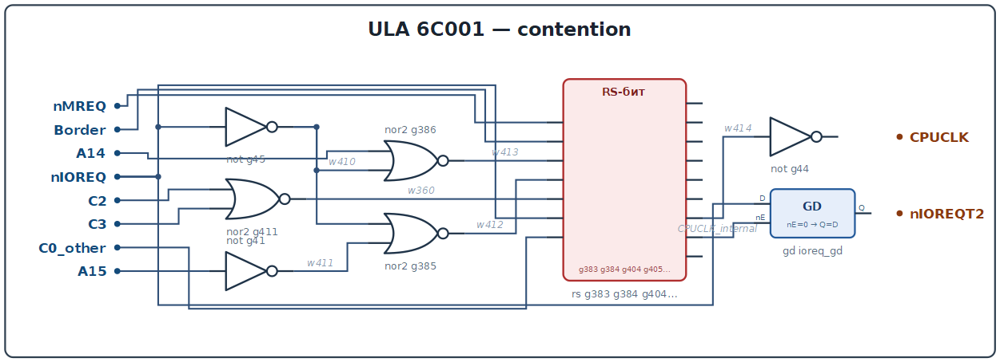.
Waveform (a CPU RAM-access attempt during a video fetch):
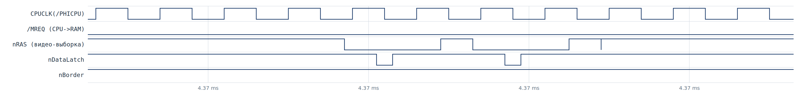.

### C++

```cpp
// contention: такт CPU = C0, растягиваемый при конфликте с видео
struct Contention {
    bool nIOREQT2 = 1;                    // защёлка nIOREQ (фаза 2)
    bool stretch = 0;                     // признак "отдать такт видео"

    void eval(bool nMREQ, bool nIOREQ, bool Border, bool A14, bool A15,
              bool C2, bool C3, bool C0) {
        // запрос CPU к RAM (0x4000-0x7FFF)
        bool cpuRAM = nMREQ == 0 && A14 == 1 && A15 == 0;
        // видео активно (не рамка) в этой части строки
        bool videoBusy = !Border && !(C2 | C3);      // упрощённо
        stretch = cpuRAM && videoBusy;
    }
    bool cpuclk(bool C0) { return stretch ? 0 : C0; }  // удержание такта
};
```

---

## 20. Top `ula` and pads

The top-level module `ula` (`hdl/ula6c001.v:6`) instantiates all 19 modules
and 35 pads. The pads are described separately in [pads.md](/pads.md); here —
only what is needed to read the module schematics:

- inputs: `OSC`, `/RD`, `/WR`, `/MREQ`, `/IOREQ`, `A15`, `A14`, `KB1..4`,
  `SOUND` (EAR, 0 in the model);
- data buses `D0..D7` — open-collector to the outside, split internally into
  `D*_from_pad`/`D*_to_pad`;
- outputs: `/RAS`, `/CAS`, `/WE`, `/ROMCS`, `A1..A6` (+ bidirectional `A0`
  with `nAE`), `/INT`, `/PHICPU` (inverting OC), `U`, `V`, `/Y` (analogue);
- keyboard lines `KB0..KB4`; `KB0` is bidirectional (test mode `K0`).

Top-level connection map (from `ula6c001.v`): *s_top*.

## 21. Simulator: `ulasim.py`

`ulasim.py` (repository root) — a tick-by-tick simulator of this same HDL in
Python:

- it parses `hdl/ula6c001.v` + `hdl/ulabase.v` itself and unfolds the
  hierarchy into a flat network (1:1 at the gate level, `gNNN` numbers kept);
- the semantics is the same as in the reference Icarus run: the 2-input `nor`
  is behavioural (“X treated as 1”), `not`/`nor3+` — ordinary three-valued
  logic, `GD` — a transparent latch;
- after every input event the network is relaxed to a fixed point — this is
  how the RS latches and master–slave cells are reproduced without
  “X-sticking”;
- it prints a VCD with the typical signal set (the `icarus/ula.gtkw`
  monitors): `OSC`, `nCLK7`, `C[8:0]`, `V[8:0]`, sync/blank/border, latch
  strobes, RAS/CAS/WE, address/data, flash/DataSelect, DAC inputs, IO ports.

Running:

```bash
python3 ulasim.py                 # typical run (with CPU activity)
python3 ulasim.py --mode idle     # ULA in vacuum
python3 ulasim.py --mode idle --end-us 15000 --vcd my.vcd
```

Honest model limitations (important when reading the waveforms):

1. `OSC` is 20 MHz (50 ns) in the model vs 14 MHz on the real chip — the
   logic is frequency independent, only the time scale differs;
2. the model's time grid is 25 ns (half period of OSC), so pulses shorter
   than ~25 ns look “one sample wide” (e.g. `nDataLatch` = 25 ns in the
   model);
3. bits `V[3..8]` of the vertical counter are marked `// not sure` in the HDL
   (the reverse engineering is unfinished) — the model honestly reproduces
   the current HDL state, including possible parasitic within-line
   transitions;
4. the CPU model (`--mode typical`) is a simplified bus-cycle generator
   synchronised to its own `CPUCLK` edges (a cycle may start only when the
   video does not own the DRAM), not a cycle-true Z80 core; continuous CPU
   cycles at the moment of a video fetch can excite the asynchronous arbiter
   (section 19), so single bus pulses were used for the contention/IO
   waveforms;
5. the analogue pads (`SOUND`, the video DAC) are still stubs in
   `hdl/ulabase.v`.

Verified model measurements (used in the sections above):

| Parameter | Value (model, OSC=20 MHz) | Real chip |
|---|---|---|
| `nCLK7` | 10 MHz (`OSC÷2`) | 7 MHz (`OSC÷2`, OSC=14 MHz) |
| scanline (`HCrst` period) | 448 `nCLK7` ticks = 44.8 µs | 448 × 142.9 ns = 64 µs |
| frame | 312 scanlines = 13.98 ms | 312 × 64 µs ≈ 20 ms |
| `V` reset | on the 312th scanline | 312 scanlines |
| `VSync` | decade `V ∈ {248..251}` | the same decade (from the gates) |
| data fetches/scanline | 32 pixel bytes + 32 attributes (in pairs) | 32+32 |
| `nAOLatch`/scanline | 56 (every 8 ticks) | 56 |

## Appendix. Mapping to the `icarus/ula.gtkw` signals

The monitor names from the testbench (Chris Smith style) and their location in
the current modular HDL:

| monitor (.gtkw) | HDL net |
|---|---|
| `nHSyncPulses` | `video_signal_features_inst.w71` |
| `C5delay` | `video_signal_features_inst.w103` |
| `HSync` | `video_signal_features_inst.w118` |
| `Burst` | `C[5]` (in the old testbench) |
| `RAM16` | `ras_cas_romcs_inst.w242` |
| `VidCASAC`/`VidCASBD` | `ras_cas_romcs_inst.w434` / `w433` |
| `MUXSEL` | `ras_cas_romcs_inst.w246` |
| `Tape`/`Speaker` | `io_inst.w487` / `io_inst.w484` (internal GD signals) |
| `Ear` | `Ear_Input` |
| `DataLatch`/`AttrLatch`/`AOLatch` | `~nDL` / `AL` / `AO` |
| `Pixel` | shift stages of `pixel_shift_reg` |

The full monitor list — `default_monitors()` in `ulasim.py`.
