# Sequential elements (issue #7)

The task of issue #7: find **all** flip-flops in the modular HDL and factor them
out into separate modules. Right now the modular HDL “falls over on Xs” exactly
because only the `GD` latches have been folded into primitives, while the
counters, the shift register, the FLASH divider and various sporadic RS latches
are still left as cross-coupled NORs right in the module text (see
[specs/hdl-vs-netlist-verification.md](/specs/hdl-vs-netlist-verification.md), section 4.2).

This section is an inventory: **what exactly** in the netlist is sequential
logic, how it is built on gates and how it is labelled on the annotated
netlist. The pictures were cut from `imgstore/ula6c001_annotated.png` by the
script [tools/gen_seq_crops.py](/tools/gen_seq_crops.py) (gate geometry is
taken from the vector `design/ula6c001.pdf`, clusters are counted from the
netlist — see section 13).

## 1. How a flip-flop is built in the ULA

The basic building block is an **RS latch made of two cross-coupled NORs** (the
only kind of storage in this chip; D flip-flops and counting cells are built
from such latches plus surrounding logic). Formally it is a strongly connected
component of the gate graph of size 2: the output of each NOR feeds the input
of the other.

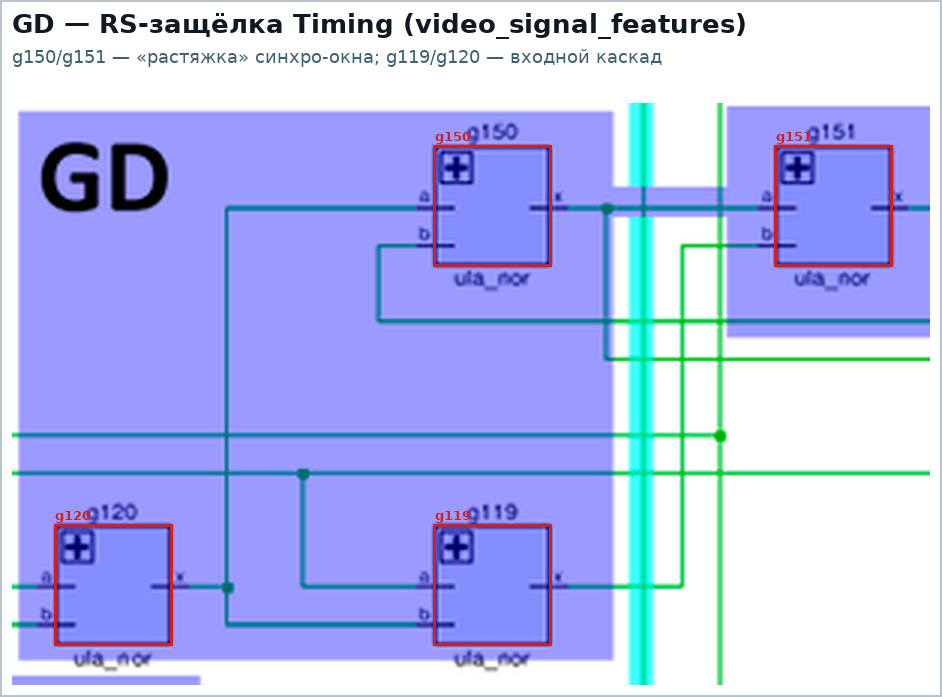

Above is the most “bare” RS latch of the chip: `g150`/`g151` (the `Timing`
signal in `video_signal_features`, the “stretching” of the sync window),
`g119`/`g120` — the input stage.

In total the netlist has **65 storage clusters** (SCCs of size > 1), of which 30
are already folded into the `GD` primitive, while 35 (245 gates) are still loose
gates:

| label in the annotation | what it is | clusters | gates | modules |
|---|---|---|---|---|
| `GD` | latch: RS core + control NORs | 39 | 2 / 4 / 5 | `data_latch`, `attr_latch`, `ao_latch`, `io`, `latch_control`, `pixel_shift_reg`, `video_signal_features` |
| `FD` | counted D flip-flop (÷2) on 6×NOR | 12 | 6 | `clkgen`, `flash_clock`, `hcounter` (bits 0..5) |
| `TCE` | V-counter toggle cell on 8×NOR | 3 | 8 | `vcounter` (bits 0..2) |
| `TRCE` | cells of bits 3..8 of the V-counter (shared gates) | 1 | 59 | `vcounter` |
| `TRC?` | cells of bits 6..8 of the H-counter (shared gates) | 1 | 25 | `hcounter` |
| `SR` | shift register cell (3×NOR + NOR3) | 8 | 4 | `pixel_shift_reg` |
| `GD` | arbiter latches + shared logic in one SCC | 1 | 15 | `contention` |

Overview map — all 65 clusters on the annotated netlist (colour = type):

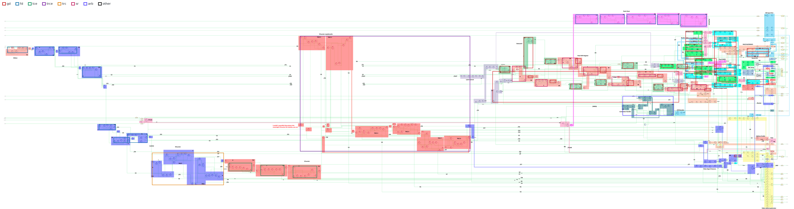

## 2. Labels on the annotated netlist

The author of the annotation labelled the blocks right on the picture — this
section records the labels as read, so that one and the same terminology is
used from here on:

| label on the picture | where (HDL module) |
|---|---|
| `GD 0..7` | `DataLatch`, `Attribute Latch`, `Attribute Output Latch`, `Pixel Shift Register` (arms of `SR`) |
| `GD 0..4` | `Border Color` = the port register (`io`: `B0_B`, `B1_R`, `B2_G`, `Tape`, `Speaker`) |
| `GD` | `Latch Control` (`VidEn`), `Contention Handler` (`/MREQ`, `/IOREQ`), `Timing` |
| `FD` | `ClkGen` (÷2), `Flash Clock` (5 cells), `HCounter` bits 0..5 |
| `TCE 0..2` | `VCounter` bits 0..2 |
| `TRCE 3..8` | `VCounter` bits 3..8 |
| `TRC` / `TRC?` / `TRCE?` | `HCounter` bits 6..8 (marked with a question mark) |
| `SR 0..7` | `Pixel Shift Register` bits 0..7 |

## 3. `GD` — latch (39 clusters)

A classic transparent latch: an RS core (`g347`/`g348`) plus an input stage that
“opens” the core on the enable `nE`. In the HDL this is already the primitive
[`GD`](/hdl/ulabase.v) (`nE=0 → Q=D`).

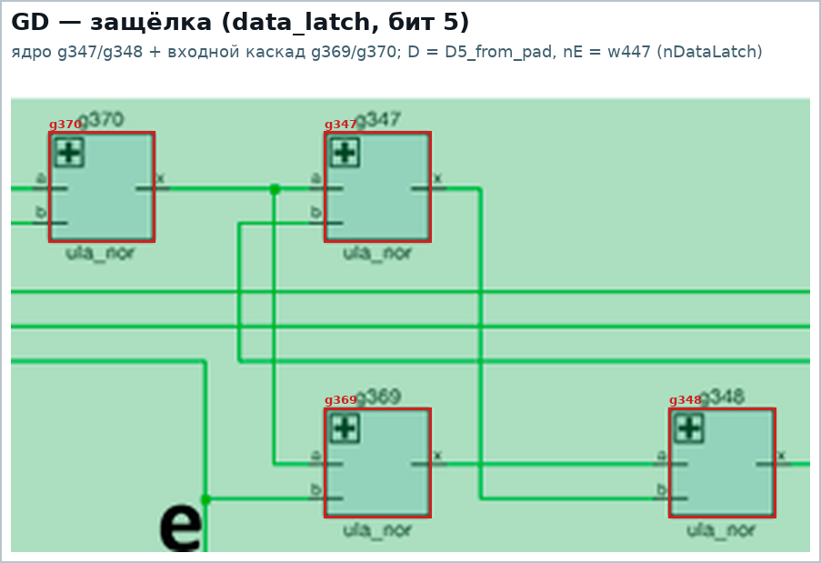

The cell occupies 4 gates (`DataLatch[5]` = `g347`, `g348`, `g369`, `g370`),
in `attr_latch` — 5 (`AttrLatch[0]` = `g221`, `g222`, `g225`, `g245`, `g246`).
Folded into the primitive: **30 clusters / 130 gates** (8 `data_latch`, 8
`attr_latch`, 8 `ao_latch`, 5 `io`, 1 `latch_control`); two more `GD` arms
(`/MREQ`, `/IOREQ`) sit inside the shared SCC of the `contention` arbiter.

Standing apart are 9 “bare” RS latches which the annotation also marks `GD`, but
which in the HDL are still at the gate level: 8 arms of the shift register
(`Pixel[0..7]` = `g483/g484`, `g463/g464`, `g457/g458`, `g440/g441`,
`g434/g435`, `g419/g420`, `g413/g414`, `g400/g401`) and `Timing`
(`g150`/`g151`). These are exactly what falls into the scope of issue #7.

## 4. `FD` — counted D flip-flop (12 clusters)

One and the same circuit on 6×NOR: two latches (master/slave) plus surrounding
logic wired as a counting ring (`nQ → D`). It works as a divide-by-2.

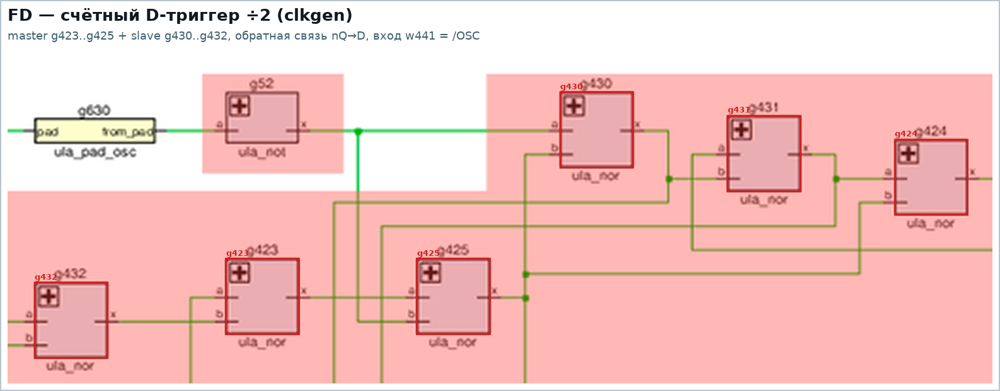

`clkgen`: `g423..g425` (master) + `g430..g432` (slave), divides `OSC` by 2 —
this is `nCLK7`, from which the H-counter, the latches and the shift register
are clocked (more detail in [specs/ula-modules.md](/specs/ula-modules.md), module 1).

The same cell is used in the FLASH divider (5 of them, in a chain):

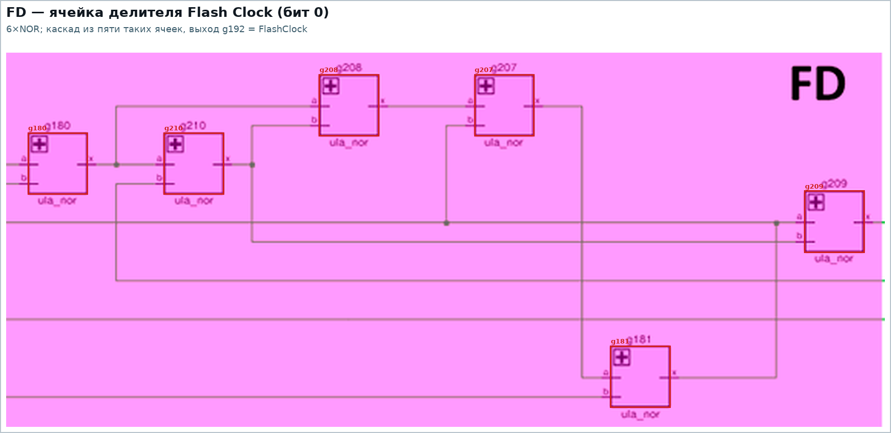

and in the H-counter — bits 0..5 (clock `w337` = `/nCLK7`, output `nC[i]`/`C[i]`):

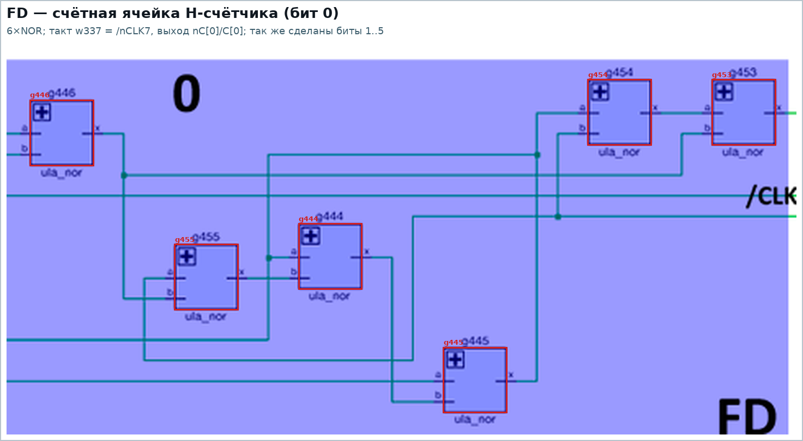

All 12 cells are **loose gates**: in the HDL they are individual `ula_nor`s, not
a module.

## 5. `TCE` — V-counter toggle cell (3 clusters)

A cell on 8×NOR (two NORs more than `FD`). Bits 0..2 each have their own SCC,
all three are clocked by `CLKHC6`:

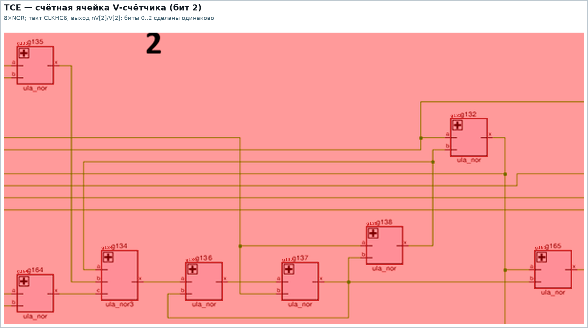

Bit 0 additionally takes `HCrst` (reset/start of line — it is at the same time
the carry in for bit 0, see [vcounter.md](/vcounter.md)), bits 1 and 2 receive
the carry from the previous bit (`w88`, `w160`).

## 6. `TRCE` — bits 3..8 of the V-counter (1 cluster, 59 gates)

Starting from bit 3 the V-counter stops being a set of separate cells: all bits
3..8 are **one SCC of 59 gates**, they share the clock `vclk2`, the reset `vrst`
and part of the carry logic. This is exactly the place that `vcounter.md` calls
“gate-spread”.

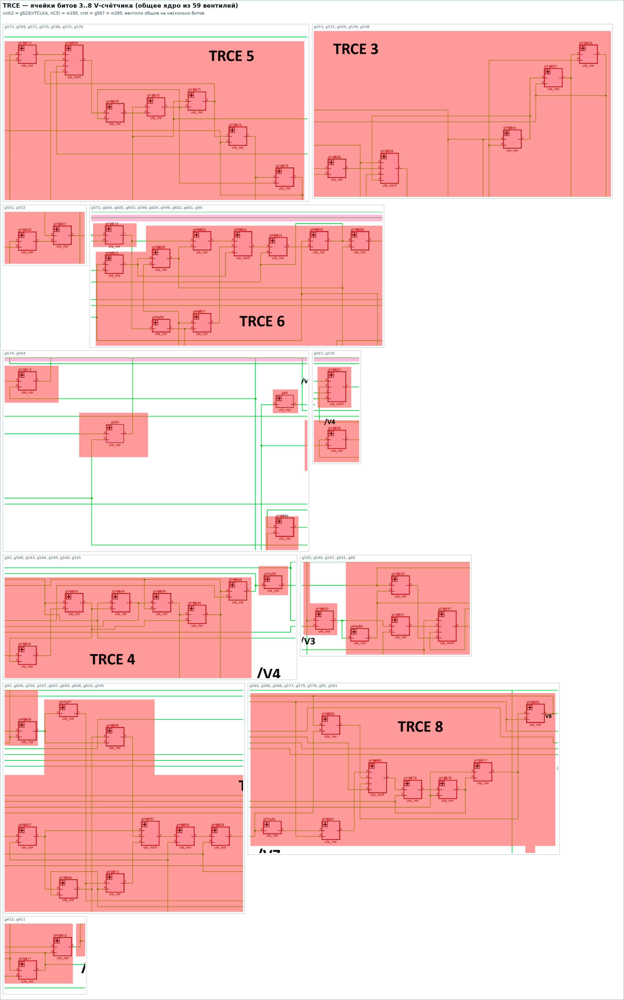

Key shared signals (verified against the netlist and the HDL):

| signal | gate | formula | who uses it |
|---|---|---|---|
| `vclk2` (`w193`) | `g523` | `nor(nTCLKA, nC5)` | `g550`, `g551` (bit 3), `g543`, `g544` (4), `g570`, `g571` (5), `g602`, `g603` (6), `g607`, `g608` (7), `g577`, `g578` (8) |
| `vrst` (`w295`) | `g567` | `nor4(nV[5], nV[4], nV[8], w278)` | `g539` (3), `g547` (4), `g569` (5), `g566` (8) |
| carry/`w278` | `g89` | `not(w98)`, where `w98` is the output of bit 2 | `g538`, `g540` (bit 3) **and** `g567` (forming `vrst`) |

The last row is that very example of economy: the inverter `g89` serves both the
carry from bit 2 into bit 3 and the additional reset `vrst`. In the cleaned-up
HDL `g89` remains an ordinary `ula_not` (that is how it is labelled in the
source), while `TRCE` is made a module without the “extra” output.

## 7. `TRC?` — bits 6..8 of the H-counter (1 cluster, 25 gates)

The symmetric place in the H-counter: bits 0..5 are separate `FD` cells, while
bits 6..8 are a single core of 25 gates with a shared `HCrst`
(`g104 = nor(nC[8], nC[7])`) and three 4-input NORs `g100`/`g116`/`g127`. In the
annotation this is marked `TRC` / `TRC?` — that is, the author of the annotation
was not sure about the type himself.

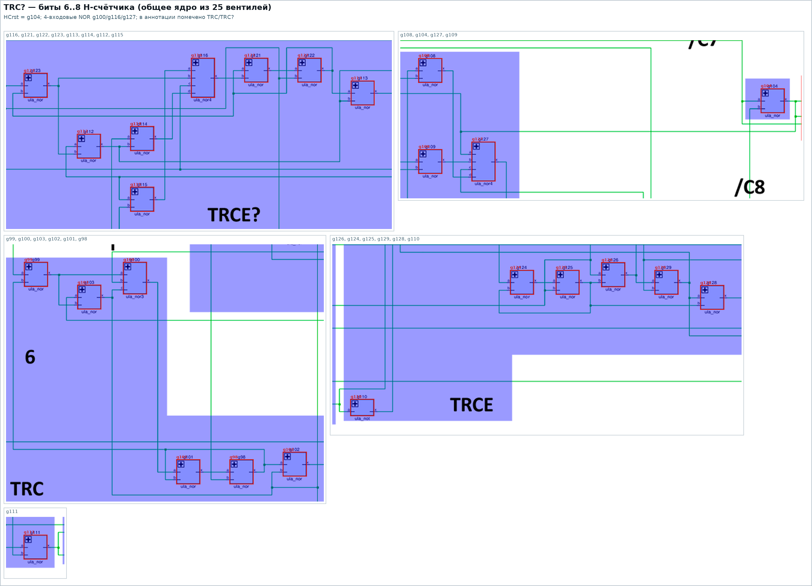

## 8. `SR` — pixel shift register (8 clusters)

A shift register cell is 4 gates (`g232`, `g233`, `g485`, `g486`): a NOR3 with
load (`g232`: `nDL[0]` + `SLoad` + arm) and an RS pair. Each bit also has its own
`GD` arm (in the annotation `GD 0..7`), that is why both parts are shown as
separate tiles in the picture:

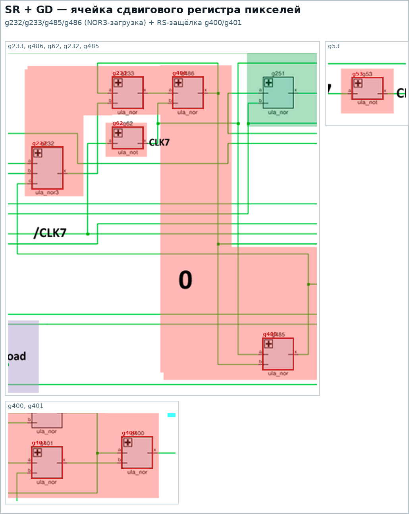

## 9. The `contention` arbiter

The `/MREQ` and `/IOREQ` latches (`GD mreq_gd`, `GD ioreq_gd`) have already been
factored out into the primitive, but their SCC is merged with the combinational
logic of the arbiter into a single cluster of 15 gates, so structurally this
place remains special:

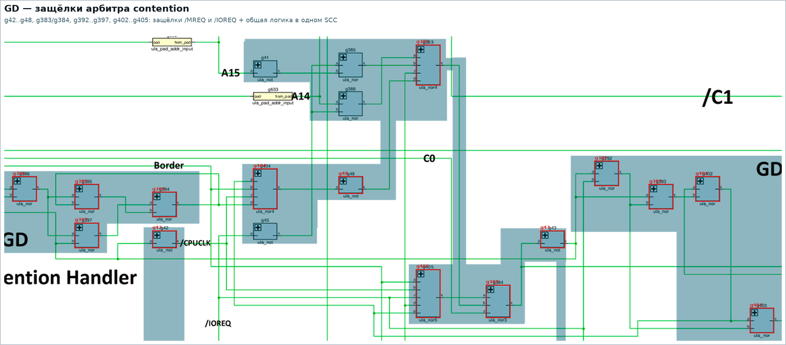

## 10. Full list of clusters

Generated by `tools/gen_seq_crops.py --table` (gates are given by their names
from the netlist, `gNNN`).

### Summary by type

| type | clusters | gates per cluster | where |
|---|---|---|---|
| `gd` (`GD`) | 39 | 2 / 4 / 5 | `data_latch`, `attr_latch`, `ao_latch`, `io`, `latch_control`, `pixel_shift_reg`, `video_signal_features` |
| `fd` (`FD`) | 12 | 6 | `clkgen`, `flash_clock`, `hcounter` |
| `tce` (`TCE`) | 3 | 8 | `vcounter` |
| `trce` (`TRCE`) | 1 | 59 | `vcounter` |
| `trc` (`TRC?`) | 1 | 25 | `hcounter` |
| `sr` (`SR`) | 8 | 4 | `pixel_shift_reg` |
| `arb` (`GD`) | 1 | 15 | `contention` |

### `clkgen`

- **FD** — `fd`, 6 gates: `g423`, `g424`, `g425`, `g430`, `g431`, `g432` (loose gates)

### `hcounter`

- **bits 6..8** — `trc`, 25 gates: `g98`, `g99`, `g100`, `g101`, `g102`, `g103`, `g104`, `g108`, `g109`, `g110`, `g111`, `g112`, `g113`, `g114`, `g115`, `g116`, `g121`, `g122`, `g123`, `g124`, `g125`, `g126`, `g127`, `g128`, `g129` (loose gates)
- **bit 0** — `fd`, 6 gates: `g444`, `g445`, `g446`, `g453`, `g454`, `g455` (loose gates)
- **bit 1** — `fd`, 6 gates: `g452`, `g468`, `g469`, `g470`, `g471`, `g472` (loose gates)
- **bit 2** — `fd`, 6 gates: `g496`, `g497`, `g498`, `g499`, `g507`, `g524` (loose gates)
- **bit 3** — `fd`, 6 gates: `g492`, `g493`, `g494`, `g495`, `g508`, `g509` (loose gates)
- **bit 4** — `fd`, 6 gates: `g510`, `g511`, `g512`, `g513`, `g521`, `g522` (loose gates)
- **bit 5** — `fd`, 6 gates: `g489`, `g490`, `g514`, `g515`, `g519`, `g520` (loose gates)

### `vcounter`

- **bit 0** — `tce`, 8 gates: `g140`, `g141`, `g142`, `g143`, `g144`, `g145`, `g146`, `g148` (loose gates)
- **bit 1** — `tce`, 8 gates: `g149`, `g157`, `g158`, `g159`, `g160`, `g161`, `g162`, `g163` (loose gates)
- **bit 2** — `tce`, 8 gates: `g132`, `g134`, `g135`, `g136`, `g137`, `g138`, `g164`, `g165` (loose gates)
- **bits 3..8** — `trce`, 59 gates: `g88`, `g93`, `g94`, `g95`, `g97`, `g536`…`g553`, `g564`…`g581`, `g595`…`g612` (loose gates)

### `data_latch`, `attr_latch`, `ao_latch`

8 latches `GD 0..7` each (4–5 gates each) — **already folded into the `GD`
primitive**; the full list of gates is printed by `tools/gen_seq_crops.py --table`
(`DataLatch[0]` = `g219`, `g220`, `g247`, `g248`, …, `AttrLatch[3]` = `g320`,
`g321`, `g343`, `g344`, `AOLatch[7]` = `g303`, `g304`, `g331`, `g332`).

### `io`

- **B0_B** — `g223`, `g224`, `g243`, `g244`; **B1_R** — `g255`, `g256`, `g278`, `g279`; **B2_G** — `g289`, `g290`, `g311`, `g312`; **Tape** — `g322`, `g323`, `g341`, `g342`; **Speaker** — `g371`, `g372`, `g381`, `g382` — **already folded into `GD`**.

### `latch_control`

- **nVidEn** — `g32`, `g466`, `g467`, `g480`, `g481` — **already folded into `GD`**.

### `pixel_shift_reg`

- 8 `SR` cells (4 gates each): `g232`, `g233`, `g485`, `g486`; `g234`, `g235`, `g461`, `g462`; `g268`, `g269`, `g459`, `g460`; `g270`, `g271`, `g438`, `g439`; `g298`, `g299`, `g436`, `g437`; `g300`, `g301`, `g417`, `g418`; `g334`, `g335`, `g415`, `g416`; `g336`, `g337`, `g398`, `g399` — **loose gates**.
- 8 `GD` arms (2 gates each): `g483`, `g484`; `g463`, `g464`; `g457`, `g458`; `g440`, `g441`; `g434`, `g435`; `g419`, `g420`; `g413`, `g414`; `g400`, `g401` — **loose gates**.

### `flash_clock`

- 5 `FD` cells (6 gates each): `g180`, `g181`, `g207`, `g208`, `g209`, `g210`; `g182`, `g183`, `g203`, `g204`, `g205`, `g206`; `g184`, `g185`, `g199`, `g200`, `g201`, `g202`; `g186`, `g187`, `g195`, `g196`, `g197`, `g198`; `g188`, `g189`, `g191`, `g192`, `g193`, `g194` — **loose gates**.

### `video_signal_features`

- **Timing** — `g150`, `g151` (`GD`, RS latch) — **loose gates**.

### `contention`

- **arbiter latches** — `g42`, `g43`, `g48`, `g383`, `g384`, `g392`, `g393`, `g394`, `g395`, `g396`, `g397`, `g402`, `g403`, `g404`, `g405` (two `GD` inside + the combinational logic of the arbiter).

## 11. VCounter: what is confirmed and what is not

A check of the findings of [vcounter.md](/vcounter.md) against the current
netlist and HDL:

**Matches:**

- “`HCrst` is at the same time the carry in for bit 0”: `g9`/`g143` feed `HCrst`
  into bit 0 of the V-counter.
- “bits 0..2 are clocked by `CLKHC6`”: `g144`/`g145`, `g157`/`g158`,
  `g137`/`g138`.
- “bits 3..8 are clocked by `vclk2`, obtained in `g523` from `/TCLKA` and `/C5`”:
  `g523 = nor(nTCLKA, nC5) → w193`, and `w193` really does go to the gates of
  bits 3..8.
- “`vrst` is produced in `g567`”: `g567 = nor4(nV[5], nV[4], nV[8], w278) → w295`.
- “`g89` from the cell of bit 3 is reused for `vrst`”: `g89 = not(w98)`
  (`w98` is the output of bit 2) feeds both the carry of bit 3 (`g538`, `g540`)
  and `g567`.
- “In the cleaned-up netlist it will simply be an additional `not`”: in
  `hdl/ula6c001.v` `g89` is left as an ordinary `ula_not`, and `g567` is built on
  `ula_nor4` — that is, a separate `TRCE` module with an extra output is not
  needed.

**Needs clarification:**

- `vcounter.md` writes “bits 3..5 — `TRCE`, bits 6..7 — again `TCE`, bit 8 —
  `TRE`”, while the annotation in the picture marks `TRCE 3..8`. By the gates:
  `vrst` (`w295`) arrives only at bits **3, 4, 5 and 8** (`g539`, `g547`, `g569`,
  `g566`), bits 6 and 7 do not use `vrst` — that is, the text of `vcounter.md`
  is structurally more precise than the annotation, and the `TRCE` label for
  bits 6/7 should be corrected.
- The claim about “`TRE` = `TRCE` without carry out” for bit 8 cannot be proved
  directly from the gates: bit 8 (`g564`..`g566`, `g577`..`g581`, `g95`) is built
  from the same 8 NORs + an inverter, and its “carry” triple
  `g577`/`g578`/`g579` is closed on itself and gives nothing outwards (to bit
  9). This indirectly confirms “the extra NOR was dropped”, but the exact form
  of the bit 8 cell in the HDL still has to be pinned down (in the source it is
  marked `// not sure`).
- In `hdl/ula6c001.v` the whole block of bits 3..8 (`// not sure`) is still not
  split into cells: the `vcounter` module is 91 gates in a row with per-bit
  comments. This is the main work of issue #7.

## 12. What is left to do on issue #7

- **Loose gates that need to be folded into modules** (35 clusters, 245 gates,
  of which 237 are still present in `hdl/`):
  - `FD` × 12 — `clkgen`, `flash_clock` (×5), `hcounter` (bits 0..5);
  - `TCE` × 3 — `vcounter` (bits 0..2);
  - `TRCE` — `vcounter` (bits 3..8, 59 gates) and `TRC?` — `hcounter`
    (bits 6..8, 25 gates);
  - `SR` × 8 + `GD` arms × 8 — `pixel_shift_reg`;
  - `GD` — the RS latch `Timing` (`g150`/`g151`);
  - `GD` — two arms in the `contention` arbiter (`/MREQ`, `/IOREQ`) in a shared SCC.
- Separately (from [specs/hdl-vs-netlist-verification.md](/specs/hdl-vs-netlist-verification.md)):
  `hdl/ulabase.v` must get the same X→0 semantics of `ula_nor` as
  `netlist/ulabase.v`, otherwise the HDL will not leave the `x` state even after
  all the flip-flops are factored out.
- After the factoring out — a repeated verification of the HDL against the
  netlist and removal of the `// not sure` marks in `vcounter`.

## 13. How to regenerate the pictures

```bash
python3 tools/gen_seq_crops.py            # imgstore/seq/*.png
python3 tools/gen_seq_crops.py --table    # cluster tables (section 10)
python3 tools/gen_seq_crops.py --check    # gate geometry consistency check
```

The script counts clusters from the netlist (`netlist/ula6c001.v`), takes the
latch names from `icarus/run_ula.v`, the bit numbers from the `// N` comments in
the HDL, and the gate coordinates from the vector `design/ula6c001.pdf` (the
same schematic that is rasterised in `design/ula6c001.png`, while
`imgstore/ula6c001_annotated.png` is its annotated copy). For the “gate-spread”
cells (V-counter, H-counter 6..8) the picture is assembled automatically from
tiles by groups of nearby gates.
