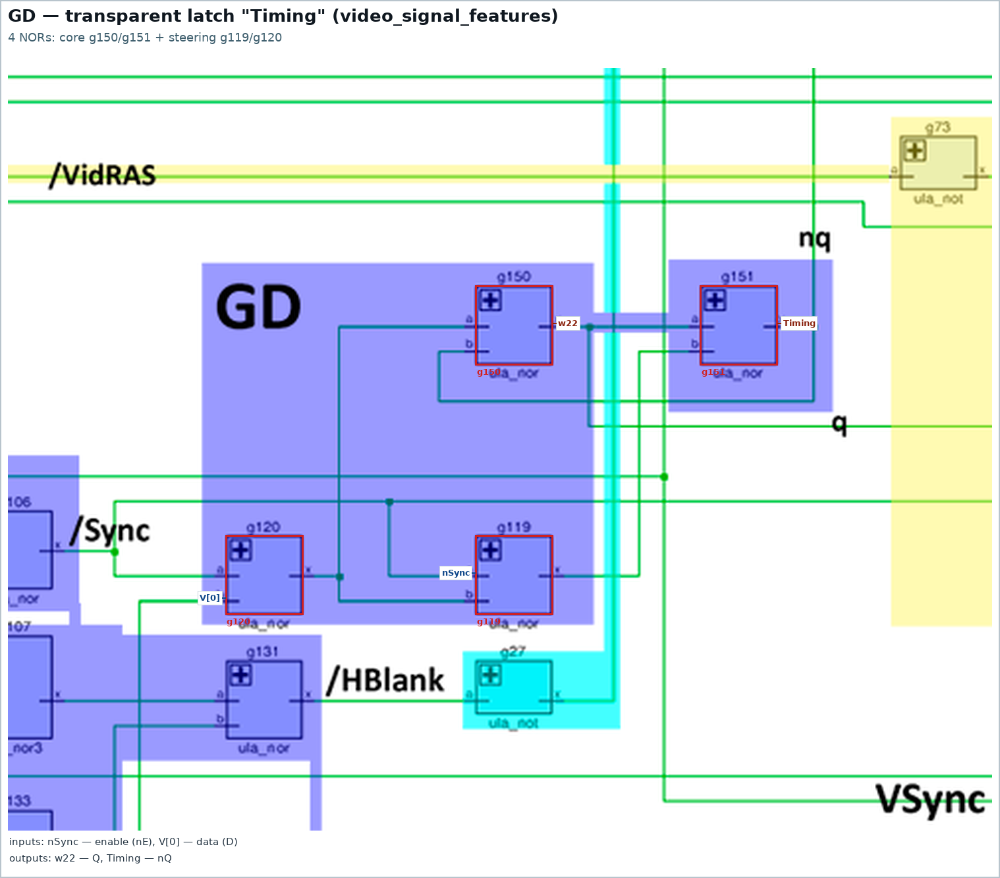

# Sequential elements (issue #7)

The task of issue #7: find **all** flip-flops in the modular HDL and factor them
out into separate modules. Right now the modular HDL “falls over on Xs” exactly
because only the `GD` latches are folded into primitives, while the counters,
the shift register, the FLASH divider and various sporadic latches are still
left as cross-coupled NORs right in the module text (see
[specs/hdl-vs-netlist-verification.md](/specs/hdl-vs-netlist-verification.md), section 4.2).

This section is an inventory of all the sequential logic of the chip: what
exactly is a flip-flop, what it is built from and how it is labelled on the
annotated netlist.
All the pictures are cut-outs from `imgstore/ula6c001_annotated.png` (on them the
inputs are labelled in blue, the outputs in red, plus a legend under the picture).

## 1. The basic element: `GD` — transparent latch (4×NOR)

The only storage element of the chip is the **transparent latch `GD`**, and it
**always occupies exactly four NORs**:

```
        S1 = nor(nE, D)          S2 = nor(S1, nE)      <- control cascade
        Q  = nor(S1, nQ)         nQ = nor(S2, Q)       <- RS core, cross-coupled NORs
```

How it works:

- with `nE = 0` (enable active) the cascade is transparent: `S1 = /D`, `S2 = D`,
  the core repeats the input, i.e. `Q = D`, `nQ = /D`;
- with `nE = 1` (passive) the inputs of the core see `S1 = S2 = 0`, and the
  cross-coupled pair of NORs **stores** the previous state;
- `Q`/`nQ` is a phase-split output; in the HDL this is the primitive
  [`GD`](/hdl/ulabase.v) (`if (~nE) val = D;`, `nQ = ~Q`).


Using bit 5 of the data latch as an example: `D = D5_from_pad`, `nE = nDataLatch`,
the core is `g347`/`g348` (this is what holds the bit), the control gates
`g369`/`g370`, the outputs `Q` (`w633`) and `nQ = nDL[5]`, which goes into the
pixel shift register.

**The chip has 65 such latches.** There are no separate “bare” RS latches of two
NORs: all 39 two-gate loops of the netlist are the RS cores of `GD` latches
(this is checked by the generator script: every `GD` has exactly 4 gates, and
every two-gate loop is somebody's core).

A second example — `Timing` (the sync-window latch in `video_signal_features`):
the same circuit, only the core is `g150`/`g151`, the control gates `g119`/`g120`,
`nE = nSync`, `D = V[0]`.



## 2. Labels on the annotated netlist

| label on the picture | what it is | where (HDL module) |
|---|---|---|
| `GD i` | transparent latch (4×NOR) | `DataLatch`, `Attribute Latch`, `Attribute Output Latch`, `Border Color` (`io`), `Latch Control`, `Contention Handler`, `Pixel Shift Register`, `Timing` |
| `FD` | counting cell = `GD` + 2 glue NORs | `ClkGen`, `Flash Clock` (5 cells), `HCounter` (bits 0..5) |
| `TCE` | counting cell = `GD` + 4 glue NORs | `VCounter` (bits 0..2) |
| `TRCE` | bits 3..8 of `VCounter`: six `GD` + shared glue logic | `VCounter` |
| `TRC` / `TRC?` | bits 6..8 of `HCounter`: three `GD` + shared glue logic | `HCounter` |
| `SR` | shift cell (4 NORs) + `GD` arm | `Pixel Shift Register` |

Map: all 65 latches (`GD`, red) and counting cells (`FD` — blue, `TCE` —
green, `SR` — magenta, the `TRCE`/`TRC` cores — purple/orange):


## 3. `GD`: 65 latches, of which 32 are already factored out into the primitive

| where | latches | status in the HDL |
|---|---|---|
| `data_latch` (`DataLatch[0..7]`) | 8 | primitive `GD` |
| `attr_latch` (`AttrLatch[0..7]`) | 8 | primitive `GD` |
| `ao_latch` (`AOLatch[0..7]`) | 8 | primitive `GD` |
| `io` (`B0_B`, `B1_R`, `B2_G`, `Tape`, `Speaker`) | 5 | primitive `GD` |
| `latch_control` (`VidEn`) | 1 | primitive `GD` |
| `contention` (`/MREQ`, `/IOREQ`) | 2 | primitive `GD` |
| `hcounter` (one per bit 0..8) | 9 | loose gates |
| `vcounter` (one per bit 0..8) | 9 | loose gates |
| `flash_clock` (divider cascade) | 5 | loose gates |
| `clkgen` (÷2) | 1 | loose gates |
| `pixel_shift_reg` (`SR` arms) | 8 | loose gates |
| `video_signal_features` (`Timing`) | 1 | loose gates |

That is, **32 latches are already folded** into the `GD` primitive
(`hdl/ulabase.v`), while **33 are still on gates** — this is the main work of
issue #7. Note: in each counting cell (`FD`, `TCE`, `TRCE`, `TRC`) there sits
exactly one `GD` latch, around which the counting glue logic is built.

The full table for each latch (module, core, control gates, `nE`, `D`)
is printed by the script: `python3 tools/gen_seq_crops.py --table`.

## 4. `FD` — counting cell (12 of them): `GD` + 2 NORs

One and the same circuit of **6 NORs**: the latch `GD` (4 gates, red in the
pictures) and two glue gates (orange) which close it into a counting ring
(`nQ → D`) and form the carry. It works as a divide-by-2.

`clkgen` — the `OSC` divider:


`hcounter`, bits 0..5 (clock `/nCLK7`, outputs `nC[i]`/`C[i]`):


`flash_clock` — a cascade of five such cells:


## 5. `TCE` — V-counter counting cell (3 of them): `GD` + 4 NORs

A cell of **8 NORs**: the same latch `GD` (red) plus four glue gates
(carry and reset by `HCrst`). Bits 0..2 of the V-counter are made identically and
are clocked by `CLKHC6`:


## 6. `TRCE` — bits 3..8 of the V-counter: 6 `GD` + shared glue logic

From bit 3 onwards the V-counter stops being a set of identical cells: bits 3..8
are **one cycle of 59 gates**, in which six `GD` latches (red) are surrounded by
shared glue logic (orange). This is exactly the place that `vcounter.md` calls
“gate-spread”.


Shared signals (verified against the netlist and the HDL):

| signal | gate | formula | who uses it |
|---|---|---|---|
| `vclk2` (`w193`) | `g523` | `nor(nTCLKA, nC5)` | gates of bits 3..8 |
| `vrst` (`w295`) | `g567` | `nor4(nV[5], nV[4], nV[8], w278)` | `g539` (bit 3), `g547` (4), `g569` (5), `g566` (8) |
| carry `w278` | `g89` | `not(w98)`, where `w98` is the output of bit 2 | `g538`, `g540` (bit 3) **and** `g567` (forming `vrst`) |

The last row is an example of economy: the inverter `g89` serves both the
carry from bit 2 into bit 3 and the additional reset `vrst`. In the cleaned-up
HDL `g89` remains an ordinary `ula_not`, while `TRCE` is made a module without
the “extra” output.

## 7. `TRC?` — bits 6..8 of the H-counter: 3 `GD` + shared glue logic

The symmetric place in the H-counter: bits 0..5 are separate `FD` cells, while
bits 6..8 are a core of 25 gates with three `GD` latches (one per bit) and a
shared `HCrst` (`g104 = nor(nC[8], nC[7])`). In the annotation this is marked
`TRC`/`TRC?` — that is, the author of the annotation was not sure about the type
himself.


## 8. `SR` — pixel shift register: shift cell + `GD`

A shift register bit is a shift cell with load (NOR3 `g337` +
`g336`/`g338`/`g399`, orange) and a **`GD` latch** at the output (red).
The trick: the control NORs of this latch (`g398`/`g399`) are shared with the
shift cell — that is why with one pair of gates the developers served both the
shift and the latch.


## 9. `contention` — two latches among the arbiter's combinational logic

In the contention arbiter there are exactly two `GD` latches — `/MREQ`
(`g394`..`g397`) and `/IOREQ` (`g392`, `g393`, `g402`, `g403`); both have
already been factored out into the `GD` primitive.
Everything else in this module (`g42`/`g43`/`g48`, `g383`/`g384`, NOR4/NOR5
`g404`/`g405`) is **ordinary combinational logic** of the arbiter and is not a
flip-flop:


## 10. Full inventory

Below is the output of `python3 tools/gen_seq_crops.py --table` (gates are given
by their names from the netlist; `nE` is the enable/clock, `D` is the data input).

### `GD` in the primitive (folded latches, 32 pcs.)

| module | latches | gates (core + control) | nE | D |
|---|---|---|---|---|
| `latch_control` | `nVidEn` | g466, g467 + g480, g481 | `nC[3]` (w203) | `nBorder` (w260) |
| `data_latch` | 8 latches | g220, g247 + g219, g248 (×8) | `nDataLatch` (w447) | `D0_from_pad` (w7) |
| `attr_latch` | 8 latches | g222, g245 + g221, g246 (×8) | `nAttrLatch` (w418) | `D0_from_pad` (w7) |
| `ao_latch` | 8 latches | g227, g228 + g225, g226 (×8) | `nAOLatch` (w340) | `AL[0]` (w506) |
| `io` | `B0_B`, `B1_R`, `B2_G`, `Tape`, `Speaker` | g224, g243 + g223, g244 (×5) | `nPortWR` (w236) | `D0_from_pad` (w7) |
| `contention` | `/IOREQ`, `/MREQ` | g402, g403 + g392, g393 (×2) | `CPUCLK_internal` (w405) | `nIOREQ_from_pad` (w259) |

### `GD` loose gates (33 pcs.)

| module | latch | core (RS) | control | nE | D |
|---|---|---|---|---|---|
| `clkgen` | FD | g424, g431 | g425, g430 | `w441` | `w443` |
| `hcounter` | C[6] | g102, g103 | g98, g99 | `CLKHC6` (w34) | `w27` |
| `hcounter` | C[7] | g112, g113 | g122, g123 | `CLKHC6` (w34) | `w82` |
| `hcounter` | C[8] | g128, g129 | g125, g126 | `CLKHC6` (w34) | `w74` |
| `hcounter` | C[0] | g453, g454 | g445, g446 | `w337` | `w476` |
| `hcounter` | C[1] | g452, g472 | g470, g471 | `w383` | `w384` |
| `hcounter` | C[2] | g507, g524 | g498, g499 | `w232` | `w230` |
| `hcounter` | C[3] | g508, g509 | g494, g495 | `w207` | `w206` |
| `hcounter` | C[4] | g521, g522 | g512, g513 | `w224` | `w225` |
| `hcounter` | C[5] | g519, g520 | g489, g490 | `w202` | `w200` |
| `vcounter` | V[0] | g140, g141 | g144, g145 | `CLKHC6` (w34) | `w35` |
| `vcounter` | V[1] | g161, g163 | g157, g158 | `CLKHC6` (w34) | `w90` |
| `vcounter` | V[2] | g132, g165 | g137, g138 | `CLKHC6` (w34) | `w96` |
| `vcounter` | V[3] | g537, g553 | g550, g551 | `vclk2` (w193) | `w281` |
| `vcounter` | V[4] | g548, g549 | g543, g544 | `vclk2` (w193) | `w185` |
| `vcounter` | V[5] | g575, g576 | g570, g571 | `vclk2` (w193) | `w183` |
| `vcounter` | V[6] | g598, g599 | g602, g603 | `vclk2` (w193) | `w192` |
| `vcounter` | V[7] | g595, g611 | g607, g608 | `vclk2` (w193) | `w302` |
| `vcounter` | V[8] | g564, g565 | g577, g578 | `vclk2` (w193) | `w326` |
| `pixel_shift_reg` | Pixel[7] | g400, g401 | g398, g399 | `w381` | `w382` |
| `pixel_shift_reg` | bit 6 | g413, g414 | g415, g416 | `w381` | `w461` |
| `pixel_shift_reg` | bit 5 | g419, g420 | g417, g418 | `w381` | `w468` |
| `pixel_shift_reg` | bit 4 | g434, g435 | g436, g437 | `w381` | `w474` |
| `pixel_shift_reg` | bit 3 | g440, g441 | g438, g439 | `w379` | `w372` |
| `pixel_shift_reg` | bit 2 | g457, g458 | g459, g460 | `w379` | `w376` |
| `pixel_shift_reg` | bit 1 | g463, g464 | g461, g462 | `w379` | `w455` |
| `pixel_shift_reg` | bit 0 | g483, g484 | g485, g486 | `w379` | `w352` |
| `flash_clock` | bit 0 | g209, g210 | g180, g181 | `w33` | `w50` |
| `flash_clock` | bit 1 | g204, g206 | g182, g183 | `w47` | `w48` |
| `flash_clock` | bit 2 | g200, g202 | g184, g185 | `w45` | `w61` |
| `flash_clock` | bit 3 | g195, g198 | g186, g187 | `w59` | `w166` |
| `flash_clock` | FlashClock | g192, g194 | g188, g189 | `w167` | `w165` |
| `video_signal_features` | Timing | g150, g151 | g119, g120 | `nSync` (w29) | `V[0]` (w25) |

### Counting and shift cells (25 pcs.)

| type | where | gates | gates |
|---|---|---|---|
| `fd` | `clkgen` | 6 | `g423`, `g424`, `g425`, `g430`, `g431`, `g432` |
| `fd` | `hcounter` bit 0 | 6 | `g444`, `g445`, `g446`, `g453`, `g454`, `g455` |
| `fd` | `hcounter` bit 1 | 6 | `g452`, `g468`, `g469`, `g470`, `g471`, `g472` |
| `fd` | `hcounter` bit 2 | 6 | `g496`, `g497`, `g498`, `g499`, `g507`, `g524` |
| `fd` | `hcounter` bit 3 | 6 | `g492`, `g493`, `g494`, `g495`, `g508`, `g509` |
| `fd` | `hcounter` bit 4 | 6 | `g510`, `g511`, `g512`, `g513`, `g521`, `g522` |
| `fd` | `hcounter` bit 5 | 6 | `g489`, `g490`, `g514`, `g515`, `g519`, `g520` |
| `trc` | `hcounter` bits 6..8 | 25 | `g98`…`g104`, `g108`…`g116`, `g121`…`g129` |
| `tce` | `vcounter` bit 0 | 8 | `g140`, `g141`, `g142`, `g143`, `g144`, `g145`, `g146`, `g148` |
| `tce` | `vcounter` bit 1 | 8 | `g149`, `g157`, `g158`, `g159`, `g160`, `g161`, `g162`, `g163` |
| `tce` | `vcounter` bit 2 | 8 | `g132`, `g134`, `g135`, `g136`, `g137`, `g138`, `g164`, `g165` |
| `trce` | `vcounter` bits 3..8 | 59 | `g88`, `g93`…`g97`, `g536`…`g553`, `g564`…`g581`, `g595`…`g612` |
| `sr` | `pixel_shift_reg` bit 0 | 4 | `g232`, `g233`, `g485`, `g486` |
| `sr` | `pixel_shift_reg` bit 1 | 4 | `g234`, `g235`, `g461`, `g462` |
| `sr` | `pixel_shift_reg` bit 2 | 4 | `g268`, `g269`, `g459`, `g460` |
| `sr` | `pixel_shift_reg` bit 3 | 4 | `g270`, `g271`, `g438`, `g439` |
| `sr` | `pixel_shift_reg` bit 4 | 4 | `g298`, `g299`, `g436`, `g437` |
| `sr` | `pixel_shift_reg` bit 5 | 4 | `g300`, `g301`, `g417`, `g418` |
| `sr` | `pixel_shift_reg` bit 6 | 4 | `g334`, `g335`, `g415`, `g416` |
| `sr` | `pixel_shift_reg` bit 7 | 4 | `g336`, `g337`, `g398`, `g399` |
| `fd` | `flash_clock` bit 0 | 6 | `g180`, `g181`, `g207`, `g208`, `g209`, `g210` |
| `fd` | `flash_clock` bit 1 | 6 | `g182`, `g183`, `g203`, `g204`, `g205`, `g206` |
| `fd` | `flash_clock` bit 2 | 6 | `g184`, `g185`, `g199`, `g200`, `g201`, `g202` |
| `fd` | `flash_clock` bit 3 | 6 | `g186`, `g187`, `g195`, `g196`, `g197`, `g198` |
| `fd` | `flash_clock` bit 4 | 6 | `g188`, `g189`, `g191`, `g192`, `g193`, `g194` |

**Total:** 65 `GD` latches (32 already a primitive + 33 loose gates) and 25 counting and
shift cells (212 gates) — 90 sequential blocks.


## 11. VCounter: what is confirmed and what is not

A check of the findings of [vcounter.md](/vcounter.md) against the current
netlist and HDL:

**Matches:**

- “`HCrst` is at the same time the carry in for bit 0”: `g9`/`g143` feed `HCrst`
  into bit 0 of the V-counter.
- “bits 0..2 are clocked by `CLKHC6`”: in each of the three `TCE` cells the control
  NORs of the latch (`g144`/`g145`, `g157`/`g158`, `g137`/`g138`) hang on
  `CLKHC6`.
- “bits 3..8 are clocked by `vclk2`, obtained in `g523` from `/TCLKA` and `/C5`”:
  `g523 = nor(nTCLKA, nC5) → w193`, and `w193` really does go to the control NORs
  of the latches of bits 3..8.
- “`vrst` is produced in `g567`”: `g567 = nor4(nV[5], nV[4], nV[8], w278) → w295`.
- “`g89` from the cell of bit 3 is reused for `vrst`”: `g89 = not(w98)`
  (`w98` is the output of bit 2) feeds both the carry of bit 3 (`g538`, `g540`)
  and `g567`.
- “In the cleaned-up netlist it will simply be an additional `not`”: in
  `hdl/ula6c001.v` `g89` is left as an ordinary `ula_not`, and `g567` is built on
  `ula_nor4` — a separate `TRCE` module with an extra output is not needed.

**Needs clarification:**

- `vcounter.md` writes “bits 3..5 — `TRCE`, bits 6..7 — again `TCE`, bit 8 —
  `TRE`”, while the annotation in the picture marks `TRCE 3..8`. By the gates:
  `vrst` (`w295`) arrives only at bits **3, 4, 5 and 8** (`g539`, `g547`, `g569`,
  `g566`), bits 6 and 7 do not use `vrst` — that is, the text of `vcounter.md`
  is structurally more precise than the annotation, and the `TRCE` label for
  bits 6/7 should be corrected.
- The claim about “`TRE` = `TRCE` without carry out” for bit 8 cannot be proved
  directly from the gates: bit 8 is built around its own `GD` latch
  (`g564`/`g565` + `g577`/`g578`), and its “carry” pair `g579`/`g578` is closed on
  itself and gives nothing outwards (to bit 9). This indirectly confirms “the
  extra NOR was dropped”, but the exact form of the bit 8 cell in the HDL still
  has to be pinned down (in the source it is marked `// not sure`).
- In `hdl/ula6c001.v` the block of bits 3..8 (`// not sure`) is still not
  split into cells: the `vcounter` module is 91 gates in a row with per-bit
  comments.

## 12. What is left to do on issue #7

- **33 `GD` latches** still living on gates: 9 in `hcounter`, 9 in `vcounter`,
  5 in `flash_clock`, 1 in `clkgen`, 8 arms in `pixel_shift_reg`, 1 `Timing`.
- **25 counting and shift cells** (212 gates) built around these latches:
  `FD` × 12, `TCE` × 3, the `TRC?` and `TRCE` cores, `SR` × 8.
- Separately (from [specs/hdl-vs-netlist-verification.md](/specs/hdl-vs-netlist-verification.md)):
  `hdl/ulabase.v` must get the same X→0 semantics of `ula_nor` as
  `netlist/ulabase.v`, otherwise the HDL will not leave the `x` state even after
  all the flip-flops are factored out.
- After the factoring out — a repeated verification of the HDL against the
  netlist and removal of the `// not sure` marks in `vcounter`.
